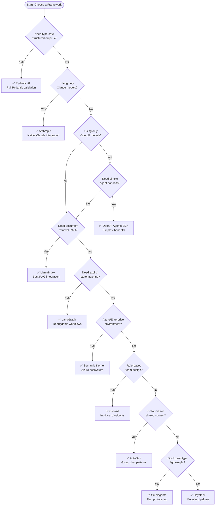

# Comparing 11 AI Agent Frameworks: A Practical Guide (2026)

> **TL;DR**: We implemented the same two-agent system (weather verification → claims eligibility) across 11 frameworks. **For insurance teams new to agents**: Start with **Pydantic AI** (type safety, structured outputs, testable). Graduate to **LangGraph** when you need complex workflows. See the [insurance-specific recommendations](#for-insurance-teams-new-to-agents) and [comparison matrix](#comprehensive-comparison-matrix).

Building multi-agent AI systems has become a critical skill for developers. But with numerous frameworks available, choosing the right one can be overwhelming. This guide provides a hands-on comparison of eleven popular agent frameworks through a real-world use case: an insurance claims weather verification system.

**Who this guide is for**: Data scientists and ML engineers who are experienced with Python and machine learning, but new to LLM agent frameworks. We assume you understand APIs, async programming, and structured data—but may not know what "tool calling" or "ReAct" means yet.

**What you'll learn:**
- How each framework handles tool definitions, multi-agent orchestration, and state management
- Detailed code patterns with explanations of why each approach works
- Common pitfalls and how to avoid them
- A decision framework to choose the right tool for your project

---

## Table of Contents

1. [What is an AI Agent?](#what-is-an-ai-agent-a-primer-for-data-scientists)
2. [For Insurance Teams](#for-insurance-teams-new-to-agents)
3. [The Challenge](#the-challenge-insurance-weather-verification)
4. [Architecture Overview](#architecture-overview)
5. [Quick Decision Flowchart](#which-framework-should-you-choose)
6. [Framework Deep Dives](#the-frameworks) (11 frameworks)
7. [DSPy for Cross-Framework Optimization](#dspy-for-cross-framework-prompt-optimization)
8. [Comprehensive Comparison Matrix](#comprehensive-comparison-matrix)
9. [Recommendations by Use Case](#recommendations-by-use-case)
10. [Setup Instructions](#setup-instructions)

---

## What is an AI Agent? A Primer for Data Scientists

If you're coming from traditional ML (scikit-learn, XGBoost, PyTorch), agents represent a different paradigm. Here's how to think about them:

### The Mental Model Shift

| Traditional ML | LLM Agents |
|----------------|------------|
| Model takes input, returns prediction | Agent takes task, decides what to do |
| You define the algorithm | LLM decides the approach |
| Fixed pipeline: preprocess → model → postprocess | Dynamic: LLM may call tools, reason, retry |
| Deterministic (same input → same output) | Stochastic (same input → variable output) |
| You control the logic | You guide with instructions, LLM executes |

### Core Concepts Explained

**1. Tool Calling (Function Calling)**
Instead of just generating text, the LLM can "call" Python functions you define. The LLM sees the function signature and docstring, decides when to use it, and you execute the actual code.

```python
# You define this function
def lookup_policy(policy_id: str) -> dict:
    """Retrieve policy details from the database."""
    return database.get_policy(policy_id)

# LLM sees: "I have a tool called lookup_policy that retrieves policy details"
# LLM decides: "The user asked about policy P12345, I should call lookup_policy('P12345')"
# Your code executes the function and returns results to the LLM
```

**2. ReAct (Reasoning + Acting)**
A pattern where the LLM alternates between thinking ("I need to find the policy first") and acting (calling a tool). Most agent frameworks implement this loop automatically.

```
User: "Is claim C789 eligible for CAT coverage?"

LLM thinks: "I need to check the policy details first"
LLM acts: calls lookup_policy("P12345")
LLM thinks: "Now I need to check the weather on the date of loss"
LLM acts: calls get_weather("2025-03-07", "-27.47", "153.02")
LLM thinks: "Strong wind was observed, policy covers CAT events"
LLM responds: "Yes, claim C789 is eligible. Strong wind was confirmed..."
```

**3. Multi-Agent Systems**
Instead of one LLM doing everything, you split responsibilities:
- **Agent A** (Weather Verification): Has tools to call external APIs
- **Agent B** (Eligibility): No tools, just applies business rules to Agent A's output

Why split? Separation of concerns, easier testing, clearer audit trails.

**4. Structured Output**
Instead of free-form text, you force the LLM to return data in a specific format:

```python
# Without structured output:
"The claim is approved because there was a storm"  # Hard to parse

# With structured output (Pydantic):
{
    "decision": "APPROVED",
    "cat_status": "CONFIRMED",
    "confidence": 0.95,
    "reasoning": "Both thunderstorms and strong wind observed"
}
```

### Why This Matters for Insurance

In insurance, you need:
- **Auditability**: Why did the system make this decision?
- **Consistency**: Same inputs should yield same outputs (as much as possible)
- **Data integrity**: Policy IDs, claim amounts, dates must be valid formats
- **Testability**: Can you write unit tests for your agent logic?

This is why **type-safe frameworks** (Pydantic AI) matter more in insurance than in consumer chatbots.

---

## For Insurance Teams New to Agents

### Our Recommendation: Start with Pydantic AI

For insurance teams building their first production agent system, we recommend **Pydantic AI** as your primary framework. Here's why:

| Insurance Need | How Pydantic AI Addresses It |
|----------------|------------------------------|
| **Structured claims data** | `output_type=ClaimDecision` forces valid JSON |
| **Auditability** | Clear input/output contracts, typed responses |
| **Testability** | Dependency injection lets you mock external APIs |
| **Data validation** | Pydantic validates Policy IDs, dates, amounts |
| **Regulatory compliance** | Typed outputs are easier to audit than free text |

### What About Our AutoGen POC?

If you built a POC with AutoGen ~1 year ago (2024-2025), be aware:

⚠️ **AutoGen 0.4 is a complete rewrite.** Your 0.2.x code will not work.

| AutoGen 0.2.x (your POC) | AutoGen 0.4.x (current) |
|--------------------------|-------------------------|
| `AssistantAgent`, `UserProxyAgent` | `AssistantAgent` (different API) |
| `initiate_chat()` | `RoundRobinGroupChat`, `run()` |
| Sync by default | Async by default |
| `ConversableAgent` | Removed/replaced |

**Our advice**: Don't try to migrate. Evaluate fresh with Pydantic AI or LangGraph.

### Framework Progression Path

```
┌─────────────────────────────────────────────────────────────────────┐
│              RECOMMENDED PROGRESSION FOR INSURANCE TEAMS             │
├─────────────────────────────────────────────────────────────────────┤
│                                                                      │
│   PHASE 1: Learn & POC (Weeks 1-4)                                  │
│   ────────────────────────────────                                  │
│   Framework: Pydantic AI                                            │
│   Why: Simplest path to type-safe agents                            │
│   Goal: Build one working agent with tools + structured output      │
│                                                                      │
│   PHASE 2: Production MVP (Weeks 5-12)                              │
│   ──────────────────────────────────                                │
│   Framework: Pydantic AI + basic orchestration                      │
│   Why: Same framework, add complexity gradually                      │
│   Goal: Two-agent pipeline (verification → decision)                │
│                                                                      │
│   PHASE 3: Scale & Complexity (When Needed)                         │
│   ─────────────────────────────────────────                         │
│   Framework: LangGraph (if workflows get complex)                   │
│   Why: Explicit state machines, checkpointing, LangSmith debugging  │
│   Goal: Complex multi-step workflows with conditional routing       │
│                                                                      │
│   OPTIONAL: Prompt Optimization                                      │
│   ────────────────────────────────                                  │
│   Framework: DSPy + GEPA                                            │
│   Why: Automatically improve prompts based on evaluation data       │
│   Goal: Optimize prompts when accuracy plateaus                     │
│                                                                      │
└─────────────────────────────────────────────────────────────────────┘
```

### Frameworks to Avoid Initially

| Framework | Why Not for New Insurance Teams |
|-----------|--------------------------------|
| **AutoGen** | Learning curve + your old POC code won't work anyway |
| **CrewAI** | "Chatty" agents may hallucinate data formats; token-heavy |
| **Semantic Kernel** | Steep learning curve, Microsoft/Azure-centric |
| **Smolagents** | Too new, limited documentation |
| **OpenAI Agents SDK** | OpenAI-only lock-in; no model flexibility |

### Frameworks to Consider Later

| Framework | When to Consider |
|-----------|------------------|
| **LangGraph** | When you need complex conditional workflows, checkpointing, or visual debugging (LangSmith) |
| **DSPy** | When you have evaluation data and want to auto-optimize prompts |
| **LlamaIndex** | When you need to combine agents with document retrieval (RAG) |

### Insurance-Specific Code Example

Here's what a Pydantic AI agent looks like with insurance data structures:

```python
from pydantic import BaseModel, Field
from pydantic_ai import Agent, RunContext
from datetime import date
from enum import Enum

# ┌─────────────────────────────────────────────────────────────────┐
# │ INSURANCE DATA MODELS: Pydantic validates everything           │
# └─────────────────────────────────────────────────────────────────┘

class CATStatus(str, Enum):
    CONFIRMED = "CONFIRMED"
    POSSIBLE = "POSSIBLE"
    NOT_CAT = "NOT_CAT"

class Decision(str, Enum):
    APPROVED = "APPROVED"
    REVIEW = "REVIEW"
    DENIED = "DENIED"

class ClaimEligibilityResult(BaseModel):
    """Structured output for CAT eligibility decisions."""
    policy_id: str = Field(pattern=r"^POL-\d{6}$")  # Must match POL-123456
    claim_id: str = Field(pattern=r"^CLM-\d{8}$")   # Must match CLM-12345678
    date_of_loss: date
    cat_status: CATStatus
    decision: Decision
    confidence: float = Field(ge=0.0, le=1.0)
    reasoning: str
    weather_summary: str

# ┌─────────────────────────────────────────────────────────────────┐
# │ AGENT DEFINITION: LLM must return valid ClaimEligibilityResult │
# └─────────────────────────────────────────────────────────────────┘

eligibility_agent = Agent(
    'openai:gpt-4o-mini',
    output_type=ClaimEligibilityResult,  # ← Forces structured output
    instructions="""You are a Claims Eligibility Agent for an insurance company.

    RULES:
    - BOTH thunderstorms AND strong wind observed = CONFIRMED CAT → APPROVED
    - Only ONE weather type observed = POSSIBLE CAT → REVIEW
    - Neither observed = NOT_CAT → DENIED

    Always validate that coordinates are within Australia."""
)

# If the LLM tries to return invalid data, Pydantic raises an error:
# - policy_id="12345" → Error: doesn't match POL-XXXXXX pattern
# - confidence=1.5 → Error: must be <= 1.0
# - decision="Maybe" → Error: must be APPROVED, REVIEW, or DENIED
```

This is **safer** than frameworks where the LLM returns free-form text that you then try to parse.

---

## The Challenge: Insurance Weather Verification

We'll build a two-agent system that processes insurance claims by verifying weather conditions:

### System Architecture

```
┌─────────────────────────────────────────────────────────────────────┐
│                        CLAIMS PROCESSING PIPELINE                    │
├─────────────────────────────────────────────────────────────────────┤
│                                                                      │
│   User Request                                                       │
│   "Verify claim for Brisbane, QLD on 2025-03-07"                    │
│                          │                                           │
│                          ▼                                           │
│   ┌──────────────────────────────────────────┐                      │
│   │      WEATHER VERIFICATION AGENT          │                      │
│   │      ─────────────────────────           │                      │
│   │      • Has tools (geocoding, BOM API)    │                      │
│   │      • Fetches real weather data         │                      │
│   │      • Returns structured observations   │                      │
│   └──────────────────────────────────────────┘                      │
│                          │                                           │
│                          │ Weather data handoff                      │
│                          ▼                                           │
│   ┌──────────────────────────────────────────┐                      │
│   │      CLAIMS ELIGIBILITY AGENT            │                      │
│   │      ─────────────────────────           │                      │
│   │      • No tools (pure reasoning)         │                      │
│   │      • Applies business rules            │                      │
│   │      • Returns: APPROVED/REVIEW/DENIED   │                      │
│   └──────────────────────────────────────────┘                      │
│                          │                                           │
│                          ▼                                           │
│   Final Decision: "APPROVED - CAT event confirmed"                  │
│                                                                      │
└─────────────────────────────────────────────────────────────────────┘
```

### Why This Example?

This use case exercises the key capabilities that differentiate agent frameworks:

| Capability | How We Test It |
|------------|----------------|
| **Tool Calling** | Geocoding API + BOM weather API |
| **Multi-Agent Handoff** | Weather → Eligibility data flow |
| **Structured Output** | JSON weather reports |
| **Business Logic** | CAT classification rules |
| **Error Handling** | Invalid locations, API failures |

### Business Rules

```
CAT Event Classification:
─────────────────────────
CONFIRMED (APPROVED): Both thunderstorms AND strong wind observed
POSSIBLE (REVIEW):    Only one weather type observed
NOT_CAT (DENIED):     Neither observed

Validation:
- Coordinates must be in Australia (-44 to -10 lat, 112 to 154 lon)
- Date must be within 90 days and not in future
```

---

## Architecture Overview

Before diving into frameworks, let's understand the common patterns they use:

### Tool Calling Patterns

```
┌─────────────────────────────────────────────────────────────────────┐
│                        TOOL CALLING LOOP                             │
├─────────────────────────────────────────────────────────────────────┤
│                                                                      │
│   1. Agent receives task                                             │
│                          │                                           │
│                          ▼                                           │
│   2. LLM decides to call tool(s)                                    │
│      └─► Returns: tool_name + arguments                             │
│                          │                                           │
│                          ▼                                           │
│   3. Framework executes tool(s)                                      │
│      └─► Returns: tool results                                       │
│                          │                                           │
│                          ▼                                           │
│   4. Results fed back to LLM                                         │
│                          │                                           │
│                          ▼                                           │
│   5. LLM decides:                                                    │
│      ├─► Call more tools? → Go to step 2                            │
│      └─► Done? → Return final response                              │
│                                                                      │
└─────────────────────────────────────────────────────────────────────┘
```

### Multi-Agent Orchestration Patterns

| Pattern | Description | Frameworks |
|---------|-------------|------------|
| **Sequential Handoff** | Agent A completes, passes to Agent B | Pydantic AI, Anthropic, Haystack |
| **Explicit State Machine** | Graph with nodes and edges | LangGraph |
| **Group Chat** | Agents in shared conversation | AutoGen |
| **Task Dependencies** | Tasks reference prior tasks | CrewAI |
| **Agent Handoff Functions** | Transfer control via functions | OpenAI Agents |
| **Managed Agents** | Wrapper pattern for sub-agents | Smolagents |

---

## The Frameworks

| Framework | Creator | Key Strength | API Flexibility | OpenAI | z.ai |
|-----------|---------|--------------|-----------------|--------|------|
| AutoGen 0.4+ | Microsoft | Collaborative multi-agent chats | High | ✅ | ✅ |
| LangGraph | LangChain | State machine orchestration | High | ✅ | ✅ |
| Pydantic AI | Pydantic | Type-safe structured outputs | High | ✅ | ✅ |
| OpenAI Agents SDK | OpenAI | Simple, lightweight handoffs | **OpenAI only** | ✅ | ❌ |
| CrewAI | CrewAI Inc | Role-based team collaboration | High | ✅ | ✅ |
| Anthropic Claude | Anthropic | Excellent reasoning, native tools | Anthropic only | N/A | N/A |
| Haystack | deepset | Pipeline-based NLP/LLM | High | ✅ | ✅ |
| Semantic Kernel | Microsoft | Kernel plugins, Azure integration | High | ✅ | ⚠️ |
| Smolagents | Hugging Face | Lightweight, sequential agents | High | ✅ | ⚠️ |
| LlamaIndex | LlamaIndex | RAG integration, ReAct agents | **OpenAI only** | ✅ | ❌ |
| **DSPy** | Stanford NLP | **Automatic prompt optimization** | High | ✅ | ✅ |

> **Note on DSPy**: Unlike other frameworks that execute prompts, DSPy also *optimizes* them. Use DSPy standalone OR as a prompt optimization layer for other frameworks.

### SDK vs Orchestration Framework

These 11 tools fall into two categories:

| Category | Frameworks | Characteristics |
|----------|------------|-----------------|
| **Low-Level SDKs** | Anthropic, OpenAI Agents | Direct API wrappers, minimal abstractions, you build orchestration |
| **High-Level Orchestration** | AutoGen, LangGraph, CrewAI, Semantic Kernel | Built-in multi-agent patterns, state management, complex workflows |
| **Specialized** | Pydantic AI (types), LlamaIndex (RAG), Haystack (NLP), Smolagents (lightweight), DSPy (optimization) | Focus on specific capabilities |

### Testing Notes (January 2026)

All 10 frameworks were tested with both real OpenAI API and z.ai (OpenAI-compatible):

**Works with Both OpenAI and z.ai:**
- **AutoGen, LangGraph, Pydantic AI, CrewAI, Haystack**: Full compatibility

**OpenAI Only:**
- **OpenAI Agents SDK**: Built-in tracing requires OpenAI infrastructure
- **LlamaIndex**: Hardcoded model validation rejects non-OpenAI models

**Partial z.ai Support (works with fixes):**
- **Semantic Kernel**: Works with sync httpx tools (asyncio.run() conflict)
- **Smolagents**: Message format issues with some alternative APIs

**Anthropic Only:**
- **Anthropic Claude**: Requires Anthropic API key (tested with claude-sonnet-4)

---

## Which Framework Should You Choose?

Use this decision flowchart to narrow down your options:

### Decision Flowchart (Mermaid)



### Text-Based Decision Tree

```
START: What are your primary requirements?
│
├─► "We're a NEW TEAM building our first agent system"
│   │
│   ├─► "We need structured data (insurance, finance, healthcare)"
│   │   └─► Pydantic AI ⭐⭐⭐ (HIGHLY RECOMMENDED)
│   │
│   └─► "We just need a quick prototype"
│       └─► Smolagents or OpenAI Agents SDK
│
├─► "I need full type safety and structured Pydantic outputs"
│   └─► Pydantic AI ⭐
│
├─► "I'm using Claude models exclusively"
│   └─► Anthropic (direct API) ⭐
│
├─► "I'm using OpenAI models exclusively"
│   ├─► "I want the simplest possible multi-agent setup"
│   │   └─► OpenAI Agents SDK ⭐
│   └─► "I need more control or RAG"
│       └─► Continue below...
│
├─► "I need to combine agents with document retrieval (RAG)"
│   └─► LlamaIndex ⭐
│
├─► "I need explicit, debuggable state machine workflows"
│   └─► LangGraph ⭐
│
├─► "I'm in an Azure/Microsoft enterprise environment"
│   └─► Semantic Kernel ⭐
│
├─► "I want role-based agents with clear responsibilities"
│   └─► CrewAI ⭐
│
├─► "I need agents with shared conversation context"
│   └─► AutoGen ⭐
│
├─► "I want quick prototyping with minimal setup"
│   └─► Smolagents ⭐
│
└─► "I'm building NLP pipelines with some agent capabilities"
    └─► Haystack ⭐
```

### Quick Selection by Priority

| Your Top Priority | Recommended Framework | Why |
|-------------------|----------------------|-----|
| **New Team + Regulated Industry** | ⭐ Pydantic AI | Type safety prevents hallucinated data formats |
| **Type Safety** | Pydantic AI | Full Pydantic validation, IDE autocomplete |
| **Debuggability** | LangGraph | Explicit state machine, step-by-step visibility |
| **Simplicity** | OpenAI Agents SDK | Minimal abstractions, just works |
| **RAG Integration** | LlamaIndex | Built for document retrieval |
| **Enterprise/Azure** | Semantic Kernel | Microsoft ecosystem, compliance |
| **Team Collaboration** | CrewAI | Role/goal/backstory design |
| **Shared Context** | AutoGen | Group chat, collaborative agents |
| **Quick Prototype** | Smolagents | Lightweight, fast iteration |
| **NLP Pipelines** | Haystack | Document processing focus |
| **Claude Models** | Anthropic | Native tool support |
| **Prompt Optimization** | ⭐ DSPy | GEPA optimizer, automatic prompt improvement |
| **Model Portability** | ⭐ DSPy | Re-optimize prompts for new models instantly |

---

## Quick Reference: Installation & Demo Files

Each framework has its own standalone demo file:

| Framework | Install | Demo File |
|-----------|---------|-----------|
| AutoGen | `pip install autogen-agentchat autogen-ext[openai]` | `autogen_demo.py` |
| LangGraph | `pip install langchain langchain-openai langgraph` | `langgraph_demo.py` |
| Pydantic AI | `pip install pydantic-ai` | `pydantic_ai_demo.py` |
| OpenAI Agents | `pip install openai-agents` | `openai_agents_demo.py` |
| CrewAI | `pip install crewai crewai-tools litellm` | `crewai_demo.py` |
| Anthropic | `pip install anthropic` | `anthropic_demo.py` |
| Haystack | `pip install haystack-ai` | `haystack_demo.py` |
| Semantic Kernel | `pip install semantic-kernel` | `semantic_kernel_demo.py` |
| Smolagents | `pip install smolagents` | `smolagents_demo.py` |
| LlamaIndex | `pip install llama-index llama-index-agent-openai llama-index-llms-openai` | `llamaindex_demo.py` |
| DSPy | `pip install dspy mlflow` | `dspy_demo.py` |

---

## Framework 1: AutoGen 0.4+

**Microsoft's multi-agent framework with event-driven architecture.**

> ⚠️ **Migration Warning**: AutoGen 0.4 (late 2024) was a **complete rewrite**. If you built a POC with AutoGen 0.2.x, your code will not work. Key changes: `ConversableAgent` removed, `initiate_chat()` replaced with `RoundRobinGroupChat`, async-first design. Consider evaluating alternatives before attempting migration.

### Philosophy

AutoGen treats agents as participants in a conversation. Multiple agents can share context through "group chats," where each agent sees what others have said. This is powerful for collaborative problem-solving but requires careful orchestration.

### Key Concepts

| Concept | Description |
|---------|-------------|
| **AssistantAgent** | LLM-powered agent that can use tools |
| **RoundRobinGroupChat** | Agents take turns in fixed sequence |
| **SelectorGroupChat** | LLM dynamically chooses next speaker |
| **Termination** | Conditions to end the conversation |

### Implementation Highlights

```python
from autogen_agentchat.agents import AssistantAgent
from autogen_ext.models.openai import OpenAIChatCompletionClient

# ┌─────────────────────────────────────────────────────────────────┐
# │ CRITICAL: For non-OpenAI APIs, you MUST provide model_info     │
# │ This tells AutoGen what capabilities the model supports        │
# └─────────────────────────────────────────────────────────────────┘
model_client = OpenAIChatCompletionClient(
    model="glm-4.5-air",
    base_url="https://api.z.ai/api/paas/v4",
    model_info={
        "vision": False,           # Does model support images?
        "function_calling": True,  # Required for tool use
        "json_output": True,       # Can model output JSON?
        "family": "unknown",       # Model family identifier
        "structured_output": True, # Supports structured responses?
    }
)

# Define tools as async functions - AutoGen runs everything async
async def geocode_location(city: str, state: str, postcode: str) -> dict:
    """Convert Australian address to coordinates.

    Note: AutoGen extracts tool schemas from function signatures
    and docstrings automatically.
    """
    async with httpx.AsyncClient() as client:
        response = await client.get(
            "https://nominatim.openstreetmap.org/search",
            params={"q": f"{city}, {state}, {postcode}, Australia", "format": "json"},
            headers={"User-Agent": "WeatherAgent/1.0"}
        )
        data = response.json()
        return {"lat": data[0]["lat"], "lon": data[0]["lon"]}

# Create agent with tools
weather_agent = AssistantAgent(
    name="WeatherAgent",
    model_client=model_client,
    tools=[geocode_location, get_bom_weather],  # Pass function references
    system_message="""You verify weather events using your tools.

    STEPS:
    1. Use geocode_location to get coordinates
    2. Use get_bom_weather to fetch observations
    3. Report findings in JSON format

    Always use tools - never make up data."""
)

# Create eligibility agent (no tools - pure reasoning)
eligibility_agent = AssistantAgent(
    name="EligibilityAgent",
    model_client=model_client,
    system_message="You determine CAT eligibility based on weather data..."
)

# ┌─────────────────────────────────────────────────────────────────┐
# │ ORCHESTRATION: RoundRobinGroupChat cycles through agents       │
# │ Weather → Eligibility → Weather → ... until termination        │
# └─────────────────────────────────────────────────────────────────┘
from autogen_agentchat.teams import RoundRobinGroupChat
from autogen_agentchat.conditions import MaxMessageTermination

team = RoundRobinGroupChat(
    participants=[weather_agent, eligibility_agent],
    termination_condition=MaxMessageTermination(max_messages=6)
)

# Run the team
result = await team.run(task="Verify weather for Brisbane, QLD, 4000 on 2025-03-07")
```

### Common Pitfalls & Solutions

| Pitfall | Solution |
|---------|----------|
| **Missing model_info** | Always provide for non-OpenAI models |
| **RoundRobin interrupts tool sequences** | Weather agent may not complete all tools before eligibility takes over. Use `MaxMessageTermination` or switch to sequential handoff |
| **Async conflicts with shared_utils** | Use `httpx.AsyncClient` directly in tools, not sync wrappers |
| **v0.2 → v0.4 migration** | Complete rewrite required; API is entirely different |

### When to Use AutoGen

✅ **Good for:**
- Collaborative agents that need shared context
- Scenarios where agents should "discuss" solutions
- Projects already in Microsoft ecosystem

❌ **Avoid for:**
- Simple sequential pipelines (overkill)
- When you need predictable, deterministic flows
- If you need strong typing

**Best For**: Collaborative agents with shared context

---

## Framework 2: LangGraph

**LangChain's explicit state machine framework for agent orchestration.**

### Philosophy

LangGraph treats agent workflows as explicit state machines. You define nodes (processing steps) and edges (transitions). This makes workflows predictable, debuggable, and easy to visualize. The tradeoff is more upfront design work.

### Key Concepts

| Concept | Description |
|---------|-------------|
| **StateGraph** | Workflow defined as directed graph |
| **TypedDict** | Schema for state passed between nodes |
| **@tool** | Decorator for LangChain tools |
| **Conditional Edges** | Dynamic routing based on state |
| **Checkpointing** | Built-in state persistence |

### Visual Workflow

```
┌─────────────────────────────────────────────────────────────────────┐
│                      LANGGRAPH WORKFLOW                              │
├─────────────────────────────────────────────────────────────────────┤
│                                                                      │
│   START ──► [weather_agent] ──► [eligibility_agent] ──► END         │
│                    │                     │                           │
│                    │ Updates state:      │ Updates state:            │
│                    │ • coordinates       │ • eligibility_decision    │
│                    │ • weather_data      │                           │
│                                                                      │
└─────────────────────────────────────────────────────────────────────┘
```

### Implementation Highlights

```python
from typing import TypedDict
from langgraph.graph import StateGraph, END
from langchain_core.tools import tool
from langchain_openai import ChatOpenAI

# ┌─────────────────────────────────────────────────────────────────┐
# │ STATE SCHEMA: TypedDict defines what data flows through graph  │
# │ Each node can read and update this state                       │
# └─────────────────────────────────────────────────────────────────┘
class ClaimState(TypedDict):
    city: str
    state: str
    postcode: str
    date: str
    coordinates: dict | None      # Populated by weather_agent
    weather_data: dict | None     # Populated by weather_agent
    eligibility_decision: str | None  # Populated by eligibility_agent

# ┌─────────────────────────────────────────────────────────────────┐
# │ TOOLS: Use @tool decorator - schema extracted from signature   │
# └─────────────────────────────────────────────────────────────────┘
@tool
def geocode_location_tool(city: str, state: str, postcode: str) -> dict:
    """Convert an Australian address to latitude/longitude coordinates.

    Args:
        city: City name (e.g., "Brisbane")
        state: State code (e.g., "QLD")
        postcode: Postcode (e.g., "4000")

    Returns:
        Dictionary with latitude and longitude
    """
    return geocode_address(city, state, postcode)

# ┌─────────────────────────────────────────────────────────────────┐
# │ NODE FUNCTIONS: Each node receives state, returns state updates │
# └─────────────────────────────────────────────────────────────────┘
def weather_agent_node(state: ClaimState) -> dict:
    """Weather verification node with tool loop."""
    llm = ChatOpenAI(model="gpt-4o-mini")
    llm_with_tools = llm.bind_tools([geocode_location_tool, bom_weather_tool])

    messages = [
        SystemMessage(content="You are a Weather Agent..."),
        HumanMessage(content=f"Verify weather for {state['city']}...")
    ]

    # Tool loop: keep calling until no more tool calls
    while True:
        response = llm_with_tools.invoke(messages)
        if not response.tool_calls:
            break
        # Execute tools and add results to messages
        for tool_call in response.tool_calls:
            result = execute_tool(tool_call)
            messages.append(ToolMessage(content=result, tool_call_id=tool_call["id"]))
        messages.append(response)

    # Return state updates (merged with existing state)
    return {
        "coordinates": extracted_coordinates,
        "weather_data": extracted_weather
    }

# ┌─────────────────────────────────────────────────────────────────┐
# │ BUILD GRAPH: Define nodes, edges, entry point                   │
# └─────────────────────────────────────────────────────────────────┘
workflow = StateGraph(ClaimState)

# Add nodes
workflow.add_node("weather_agent", weather_agent_node)
workflow.add_node("eligibility_agent", eligibility_agent_node)

# Define flow
workflow.set_entry_point("weather_agent")
workflow.add_edge("weather_agent", "eligibility_agent")
workflow.add_edge("eligibility_agent", END)

# Compile and run
app = workflow.compile()
result = app.invoke({
    "city": "Brisbane",
    "state": "QLD",
    "postcode": "4000",
    "date": "2025-03-07"
})
```

### Conditional Routing Example

```python
# Route based on weather severity
def should_escalate(state: ClaimState) -> str:
    """Conditional edge: route based on state."""
    if state["weather_data"].get("severe"):
        return "priority_review"
    return "standard_review"

workflow.add_conditional_edges(
    "weather_agent",
    should_escalate,
    {
        "priority_review": "priority_agent",
        "standard_review": "eligibility_agent"
    }
)
```

### Common Pitfalls & Solutions

| Pitfall | Solution |
|---------|----------|
| **Tool loop not completing** | Implement explicit loop in node function; LangGraph doesn't auto-loop |
| **State not updating** | Return only changed fields; they merge with existing state |
| **Graph not compiling** | Ensure all nodes have outgoing edges (except END) |
| **Debugging difficulty** | Use `app.get_graph().print_ascii()` to visualize |

### When to Use LangGraph

✅ **Good for:**
- Production systems needing explicit control flow
- Complex workflows with conditional branching
- Teams that want to visualize and debug agent flows
- Long-running workflows needing checkpointing

**Pro Tip**: Use **LangSmith** (LangChain's observability platform) with LangGraph for visual debugging. The step-by-step trace viewer is often the deciding factor for production teams.

❌ **Avoid for:**
- Simple two-agent handoffs (overkill)
- Quick prototypes (setup overhead)
- Teams unfamiliar with graph concepts

**Best For**: Production systems requiring explicit control flow

---

## Framework 3: Pydantic AI

**Type-safe agent framework with full Pydantic integration.**

### Philosophy

Pydantic AI brings the same type safety and validation that made Pydantic popular to the agent world. You define structured output models, and the framework ensures LLM responses conform to your schema. Dependency injection keeps tools testable and clean.

### Key Concepts

| Concept | Description |
|---------|-------------|
| **Agent** | Core class with model, tools, output schema |
| **output_type** | Pydantic model for structured responses |
| **@agent.tool** | Tool decorator with RunContext |
| **deps_type** | Type-safe dependency injection |
| **RunContext** | Access dependencies in tools |

### Implementation Highlights

```python
from pydantic_ai import Agent, RunContext
from pydantic import BaseModel, Field
from dataclasses import dataclass
import httpx

# ┌─────────────────────────────────────────────────────────────────┐
# │ OUTPUT SCHEMA: Pydantic model defines structured output        │
# │ LLM response MUST conform to this schema                       │
# └─────────────────────────────────────────────────────────────────┘
class WeatherVerificationResult(BaseModel):
    """Structured weather verification output."""
    location: str = Field(description="Full address verified")
    latitude: float = Field(ge=-90, le=90)  # Validation!
    longitude: float = Field(ge=-180, le=180)
    thunderstorms: str = Field(description="Observed/Not observed")
    strong_wind: str = Field(description="Observed/Not observed")
    severe_weather_confirmed: bool = Field(
        description="True if BOTH thunderstorms AND strong wind observed"
    )

class EligibilityDecision(BaseModel):
    """Structured eligibility output."""
    cat_event_status: str = Field(pattern="^(CONFIRMED|POSSIBLE|NOT_CAT)$")
    eligibility_decision: str = Field(pattern="^(APPROVED|REVIEW|DENIED)$")
    confidence: float = Field(ge=0.0, le=1.0)
    reasoning: str

# ┌─────────────────────────────────────────────────────────────────┐
# │ DEPENDENCIES: Injected into tools via RunContext               │
# │ Makes tools testable - swap real HTTP client for mock in tests │
# └─────────────────────────────────────────────────────────────────┘
@dataclass
class AppDependencies:
    http_client: httpx.AsyncClient

# ┌─────────────────────────────────────────────────────────────────┐
# │ AGENT DEFINITION: Note the parameter names (changed in v1.44+) │
# │ - output_type (not result_type)                                │
# │ - instructions (not system_prompt)                             │
# └─────────────────────────────────────────────────────────────────┘
weather_agent = Agent(
    'openai:gpt-4o-mini',  # Format: provider:model
    deps_type=AppDependencies,
    output_type=WeatherVerificationResult,
    instructions="""You are a Weather Verification Agent.

    STEPS:
    1. Use geocode tool to get coordinates
    2. Use bom_weather tool to fetch observations
    3. Return structured WeatherVerificationResult

    Always use tools - never fabricate data."""
)

# ┌─────────────────────────────────────────────────────────────────┐
# │ TOOLS: Decorated with @agent.tool, receive RunContext          │
# └─────────────────────────────────────────────────────────────────┘
@weather_agent.tool
async def geocode(
    ctx: RunContext[AppDependencies],  # Type-safe context access
    city: str,
    state: str,
    postcode: str
) -> dict:
    """Convert Australian address to coordinates.

    Args:
        city: City name (e.g., "Brisbane")
        state: State code (e.g., "QLD")
        postcode: Postcode (e.g., "4000")
    """
    response = await ctx.deps.http_client.get(
        "https://nominatim.openstreetmap.org/search",
        params={"q": f"{city}, {state}, {postcode}, Australia", "format": "json"},
        headers={"User-Agent": "WeatherAgent/1.0"}
    )
    data = response.json()
    return {"latitude": float(data[0]["lat"]), "longitude": float(data[0]["lon"])}

# ┌─────────────────────────────────────────────────────────────────┐
# │ RUNNING THE AGENT                                               │
# │ Note: result.output (not .data or .response in latest version) │
# └─────────────────────────────────────────────────────────────────┘
async def main():
    async with httpx.AsyncClient() as client:
        deps = AppDependencies(http_client=client)

        weather_result = await weather_agent.run(
            "Verify weather for Brisbane, QLD, 4000 on 2025-03-07",
            deps=deps
        )

        # Access the Pydantic model - fully typed!
        weather_output: WeatherVerificationResult = weather_result.output
        print(f"Lat: {weather_output.latitude}")  # IDE autocomplete works!
        print(f"Severe: {weather_output.severe_weather_confirmed}")

        # Manual handoff to eligibility agent
        eligibility_agent = Agent(
            'openai:gpt-4o-mini',
            output_type=EligibilityDecision,
            instructions="Evaluate CAT eligibility based on weather data..."
        )

        eligibility_result = await eligibility_agent.run(
            f"Evaluate: {weather_output.model_dump_json()}"
        )
        decision: EligibilityDecision = eligibility_result.output
```

### Common Pitfalls & Solutions

| Pitfall | Solution |
|---------|----------|
| **`.data` AttributeError** | Use `.output` (API changed in v1.44+) |
| **`result_type` not found** | Use `output_type` parameter |
| **`system_prompt` not found** | Use `instructions` parameter |
| **LLM doesn't match schema** | Add clear instructions about required fields |
| **Testing difficulty** | Swap deps with mocks: `deps=MockDependencies()` |

### When to Use Pydantic AI

✅ **Good for:**
- Projects requiring validated, structured outputs
- Teams that want IDE autocomplete for agent responses
- Codebases already using Pydantic extensively
- When you need testable agents (dependency injection)

**Pro Tip**: Pydantic AI's dependency injection (`deps_type`) is the only framework here that treats **unit testing as a first-class citizen**. Swap `deps=RealDependencies()` for `deps=MockDependencies()` in tests—no monkey-patching required.

❌ **Avoid for:**
- Unstructured, conversational agents
- Teams not familiar with Pydantic
- When API stability is critical (still evolving)

**Best For**: Teams prioritizing type safety and structured outputs

---

## Framework 4: OpenAI Agents SDK

**OpenAI's official lightweight agent framework.**

### Philosophy

The OpenAI Agents SDK is designed for simplicity. It has minimal abstractions - just Agents with tools and optional handoffs to other agents. This makes it the easiest framework to learn but limits you to OpenAI models.

### Key Concepts

| Concept | Description |
|---------|-------------|
| **Agent** | Instructions + tools + optional handoffs |
| **Runner** | Executes agent conversations |
| **@function_tool** | Decorator for tool functions |
| **Handoff** | Function that returns another agent |

### Implementation Highlights

```python
from agents import Agent, Runner, function_tool

# ┌─────────────────────────────────────────────────────────────────┐
# │ TOOLS: Simple @function_tool decorator                         │
# │ Must return strings (JSON for structured data)                 │
# └─────────────────────────────────────────────────────────────────┘
@function_tool
def geocode_location(city: str, state: str, postcode: str) -> str:
    """Convert Australian address to coordinates.

    Args:
        city: City name
        state: State code
        postcode: Postcode
    """
    result = geocode_address(city, state, postcode)
    return json.dumps(result)  # Must return string

@function_tool
def get_bom_weather(lat: float, lon: float, date: str, state: str) -> str:
    """Fetch weather from Bureau of Meteorology."""
    result = fetch_bom_observations(lat, lon, date, state)
    return json.dumps(result)

# ┌─────────────────────────────────────────────────────────────────┐
# │ AGENTS: Create eligibility agent FIRST (it's a handoff target) │
# └─────────────────────────────────────────────────────────────────┘
eligibility_agent = Agent(
    name="Claims Eligibility Agent",
    instructions="""Evaluate weather data and determine CAT eligibility.

    RULES:
    - BOTH thunderstorms AND strong wind "Observed" = APPROVED
    - Only ONE "Observed" = REVIEW
    - Neither "Observed" = DENIED

    Respond with JSON: {cat_event_status, eligibility_decision, confidence, reasoning}""",
    tools=[]  # No tools - pure reasoning
)

# ┌─────────────────────────────────────────────────────────────────┐
# │ HANDOFF: Function that returns another agent                    │
# │ When weather agent is done, it calls this to transfer control  │
# └─────────────────────────────────────────────────────────────────┘
def transfer_to_eligibility():
    """Transfer to Claims Eligibility Agent for final decision."""
    return eligibility_agent

weather_agent = Agent(
    name="Weather Verification Agent",
    instructions="""You verify weather events for insurance claims.

    STEPS:
    1. Use geocode_location to get coordinates
    2. Use get_bom_weather to fetch observations
    3. Report your findings
    4. Call transfer_to_eligibility when done

    Always use tools - never make up data.""",
    tools=[geocode_location, get_bom_weather, transfer_to_eligibility]
)

# ┌─────────────────────────────────────────────────────────────────┐
# │ RUNNING: Simple async execution                                 │
# └─────────────────────────────────────────────────────────────────┘
async def main():
    runner = Runner()
    result = await runner.run(
        starting_agent=weather_agent,
        input="Verify weather for Brisbane, QLD, 4000 on 2025-03-07"
    )
    print(result.final_output)
```

### Common Pitfalls & Solutions

| Pitfall | Solution |
|---------|----------|
| **Non-OpenAI API fails** | This SDK is OpenAI-only; use a different framework |
| **Tool returns non-string** | Always return `json.dumps(result)` |
| **Handoff not triggered** | Add explicit instruction to call handoff function |
| **Tracing errors with alt APIs** | Built-in tracing requires OpenAI infrastructure |

### When to Use OpenAI Agents SDK

✅ **Good for:**
- Simple multi-agent flows
- Teams committed to OpenAI models
- Quick prototypes where simplicity matters
- Learning agent concepts

❌ **Avoid for:**
- Projects needing model flexibility
- Enterprise environments requiring vendor diversity
- Complex orchestration patterns

**Best For**: Simple multi-agent flows exclusively using OpenAI models

---

## Framework 5: CrewAI

**Role-based multi-agent collaboration framework.**

### Philosophy

CrewAI models agents as team members with roles, goals, and backstories. This human-centric design makes it intuitive to reason about what each agent should do. Tasks define specific assignments, and dependencies ensure proper sequencing.

### Key Concepts

| Concept | Description |
|---------|-------------|
| **Agent** | Role + goal + backstory + tools |
| **Task** | Work assignment with expected output |
| **Crew** | Team of agents executing tasks |
| **context** | Task dependencies (data flow) |
| **Process** | Sequential or hierarchical execution |

### Implementation Highlights

```python
from crewai import Agent, Task, Crew, Process, LLM
from crewai.tools import tool
import json

# ┌─────────────────────────────────────────────────────────────────┐
# │ LLM: CrewAI uses LiteLLM format (provider/model)               │
# └─────────────────────────────────────────────────────────────────┘
llm = LLM(model="openai/gpt-4o-mini")  # or "openai/glm-4.5-air" for alt API

# ┌─────────────────────────────────────────────────────────────────┐
# │ TOOLS: Use @tool decorator with descriptive name               │
# │ Tool description comes from docstring                          │
# └─────────────────────────────────────────────────────────────────┘
@tool("Geocode Australian Address")
def geocode_tool(city: str, state: str, postcode: str) -> str:
    """Convert an Australian address to latitude/longitude coordinates.

    Args:
        city: City name (e.g., "Brisbane")
        state: State code (e.g., "QLD")
        postcode: Postcode (e.g., "4000")

    Returns:
        JSON with latitude, longitude, and display_name
    """
    result = geocode_address(city, state, postcode)
    return json.dumps(result)

@tool("Fetch BOM Weather Data")
def bom_weather_tool(lat: float, lon: float, date: str, state: str) -> str:
    """Fetch weather observations from Australian Bureau of Meteorology."""
    result = fetch_bom_observations(lat, lon, date, state)
    return json.dumps(result)

# ┌─────────────────────────────────────────────────────────────────┐
# │ AGENTS: Define role, goal, backstory for each                  │
# │ Backstory helps the LLM understand agent's perspective         │
# └─────────────────────────────────────────────────────────────────┘
weather_agent = Agent(
    role="Weather Verification Specialist",
    goal="Verify severe weather events from official Australian sources",
    backstory="""You are an expert meteorologist with 20 years of experience
    analyzing Australian weather patterns. You have direct access to Bureau
    of Meteorology data and can accurately determine if severe weather
    events occurred at specific locations on specific dates.""",
    tools=[geocode_tool, bom_weather_tool],
    llm=llm,
    verbose=True  # See agent reasoning
)

eligibility_agent = Agent(
    role="Insurance Claims Assessor",
    goal="Determine CAT event eligibility based on weather verification",
    backstory="""You are a senior insurance claims assessor specializing
    in catastrophic event classification. You apply strict business rules
    to ensure fair and consistent eligibility determinations.""",
    tools=[],  # No tools - pure reasoning
    llm=llm,
    verbose=True
)

# ┌─────────────────────────────────────────────────────────────────┐
# │ TASKS: Define work assignments with expected outputs           │
# └─────────────────────────────────────────────────────────────────┘
weather_task = Task(
    description="""Verify weather conditions for Brisbane, QLD, 4000 on 2025-03-07.

    Steps:
    1. Use the geocoding tool to get coordinates
    2. Use the BOM weather tool to fetch observations
    3. Report thunderstorm and strong wind observations""",
    expected_output="""A structured JSON report containing:
    - location (verified address)
    - coordinates (lat/lon)
    - thunderstorms (Observed/Not observed)
    - strong_wind (Observed/Not observed)""",
    agent=weather_agent
)

eligibility_task = Task(
    description="""Determine CAT event eligibility based on weather verification.

    Business Rules:
    - BOTH thunderstorms AND strong wind "Observed" = APPROVED
    - Only ONE "Observed" = REVIEW
    - Neither "Observed" = DENIED""",
    expected_output="""JSON with: cat_event_status, eligibility_decision,
    confidence (0-1), and reasoning""",
    agent=eligibility_agent,
    context=[weather_task]  # ← KEY: This task uses weather_task output
)

# ┌─────────────────────────────────────────────────────────────────┐
# │ CREW: Combine agents and tasks, define process                 │
# └─────────────────────────────────────────────────────────────────┘
crew = Crew(
    agents=[weather_agent, eligibility_agent],
    tasks=[weather_task, eligibility_task],
    process=Process.sequential,  # Tasks run in order
    verbose=True
)

# Run the crew
result = crew.kickoff()
print(result)
```

### Common Pitfalls & Solutions

| Pitfall | Solution |
|---------|----------|
| **Circular dependencies** | Ensure `context` doesn't create cycles |
| **Tool not called** | Add explicit instruction in task description |
| **Verbose output overwhelming** | Set `verbose=False` in production |
| **Agent ignores backstory** | Keep backstory focused and relevant |
| **Task output mismatch** | Match `expected_output` to what LLM can produce |
| **High token costs** | CrewAI is token-heavy; role/goal/backstory inflate prompts |

### When to Use CrewAI

**Cost Note**: CrewAI's role-based design sends verbose system prompts (role + goal + backstory) with every request. This improves agent behavior but increases token costs compared to minimal frameworks like OpenAI Agents.

✅ **Good for:**
- Teams that think in terms of roles and responsibilities
- Projects where agents have distinct "personalities"
- Non-technical stakeholders who need to understand the system
- Rapid prototyping with intuitive mental model

❌ **Avoid for:**
- Simple two-agent handoffs (too much boilerplate)
- Performance-critical applications (verbose)
- When you need fine-grained control over agent interactions

**Best For**: Teams designing agent "crews" with clear role separation

---

## Framework 6: Anthropic Claude

**Direct Anthropic API with manual orchestration for multi-agent patterns.**

### Philosophy

The Anthropic SDK is not a "framework" in the same sense as LangGraph or CrewAI—it's a **low-level SDK** that gives you direct access to Claude's capabilities. You build your own orchestration on top. This means more code, but also complete control and no framework abstractions to debug.

For insurance teams: Claude models are known for excellent instruction following and reasoning. If you need an LLM that reliably follows complex business rules, Claude is a strong choice.

### Key Concepts

| Concept | Description |
|---------|-------------|
| **client.messages.create()** | Core API call to send messages and get responses |
| **tools** | JSON schema definitions for functions Claude can call |
| **stop_reason** | Why Claude stopped: "end_turn", "tool_use", "max_tokens" |
| **tool_use block** | Claude's request to call a tool (in response content) |
| **tool_result** | Your response after executing the tool |

### How Tool Calling Works

```
┌─────────────────────────────────────────────────────────────────────┐
│                 ANTHROPIC TOOL CALLING FLOW                          │
├─────────────────────────────────────────────────────────────────────┤
│                                                                      │
│   1. You send: messages + tools (JSON schemas)                       │
│                          │                                           │
│                          ▼                                           │
│   2. Claude responds with stop_reason="tool_use"                     │
│      Response contains: tool_use block with name + input             │
│                          │                                           │
│                          ▼                                           │
│   3. You execute the tool with the provided input                    │
│                          │                                           │
│                          ▼                                           │
│   4. You send: tool_result message back to Claude                    │
│                          │                                           │
│                          ▼                                           │
│   5. Claude continues (may call more tools or finish)                │
│      Check stop_reason again: "tool_use" → loop, "end_turn" → done  │
│                                                                      │
└─────────────────────────────────────────────────────────────────────┘
```

### Implementation Highlights

```python
import anthropic
import json

# ┌─────────────────────────────────────────────────────────────────┐
# │ CLIENT SETUP: Just needs API key                                │
# └─────────────────────────────────────────────────────────────────┘
client = anthropic.Anthropic(api_key="your-api-key")

# ┌─────────────────────────────────────────────────────────────────┐
# │ TOOL DEFINITIONS: JSON Schema format                            │
# │ Claude uses these to understand when/how to call your functions │
# └─────────────────────────────────────────────────────────────────┘
tools = [
    {
        "name": "geocode_location",
        "description": "Convert an Australian address to latitude/longitude coordinates. Use this to get coordinates before fetching weather data.",
        "input_schema": {
            "type": "object",
            "properties": {
                "city": {
                    "type": "string",
                    "description": "City name (e.g., 'Brisbane')"
                },
                "state": {
                    "type": "string",
                    "description": "Australian state code (e.g., 'QLD')"
                },
                "postcode": {
                    "type": "string",
                    "description": "Postcode (e.g., '4000')"
                }
            },
            "required": ["city", "state", "postcode"]
        }
    },
    {
        "name": "get_bom_weather",
        "description": "Fetch weather observations from the Australian Bureau of Meteorology for a specific location and date.",
        "input_schema": {
            "type": "object",
            "properties": {
                "lat": {"type": "number", "description": "Latitude"},
                "lon": {"type": "number", "description": "Longitude"},
                "date": {"type": "string", "description": "Date in YYYY-MM-DD format"},
                "state": {"type": "string", "description": "Australian state code"}
            },
            "required": ["lat", "lon", "date", "state"]
        }
    }
]

# ┌─────────────────────────────────────────────────────────────────┐
# │ TOOL EXECUTION: Map tool names to your Python functions         │
# └─────────────────────────────────────────────────────────────────┘
def execute_tool(tool_name: str, tool_input: dict) -> str:
    """Execute a tool and return the result as a string."""
    if tool_name == "geocode_location":
        result = geocode_address(
            tool_input["city"],
            tool_input["state"],
            tool_input["postcode"]
        )
    elif tool_name == "get_bom_weather":
        result = fetch_bom_observations(
            tool_input["lat"],
            tool_input["lon"],
            tool_input["date"],
            tool_input["state"]
        )
    else:
        result = {"error": f"Unknown tool: {tool_name}"}
    return json.dumps(result)

# ┌─────────────────────────────────────────────────────────────────┐
# │ WEATHER AGENT: Tool loop until Claude finishes                  │
# └─────────────────────────────────────────────────────────────────┘
def run_weather_agent(task: str) -> str:
    """Run the weather verification agent with tool loop."""

    messages = [{"role": "user", "content": task}]

    system_prompt = """You are a Weather Verification Agent. Your job is to verify severe weather events for insurance claims.

    STEPS:
    1. Use geocode_location to convert the address to coordinates
    2. Use get_bom_weather to fetch weather observations for the date
    3. Report your findings in JSON format with: location, coordinates, thunderstorms, strong_wind

    Always use your tools - never make up data."""

    while True:
        # Call Claude
        response = client.messages.create(
            model="claude-sonnet-4-20250514",  # Latest Claude model
            max_tokens=1024,
            system=system_prompt,
            tools=tools,
            messages=messages
        )

        # Check if Claude wants to use tools
        if response.stop_reason == "tool_use":
            # Find tool_use blocks in response
            assistant_content = response.content
            messages.append({"role": "assistant", "content": assistant_content})

            # Process each tool call
            tool_results = []
            for block in assistant_content:
                if block.type == "tool_use":
                    print(f"  → Tool call: {block.name}")
                    result = execute_tool(block.name, block.input)
                    print(f"    → Result: {result[:100]}...")
                    tool_results.append({
                        "type": "tool_result",
                        "tool_use_id": block.id,
                        "content": result
                    })

            # Send tool results back to Claude
            messages.append({"role": "user", "content": tool_results})

        else:
            # Claude is done - extract final text response
            final_text = ""
            for block in response.content:
                if hasattr(block, "text"):
                    final_text += block.text
            return final_text

# ┌─────────────────────────────────────────────────────────────────┐
# │ ELIGIBILITY AGENT: No tools, just reasoning                     │
# └─────────────────────────────────────────────────────────────────┘
def run_eligibility_agent(weather_report: str) -> str:
    """Run the eligibility agent (pure reasoning, no tools)."""

    response = client.messages.create(
        model="claude-sonnet-4-20250514",
        max_tokens=1024,
        system="""You are a Claims Eligibility Agent. Evaluate weather data and determine CAT eligibility.

        RULES:
        - BOTH thunderstorms AND strong wind "Observed" = CONFIRMED CAT → APPROVED
        - Only ONE "Observed" = POSSIBLE CAT → REVIEW
        - Neither "Observed" = NOT CAT → DENIED

        Respond with JSON: {cat_event_status, eligibility_decision, confidence, reasoning}""",
        messages=[{"role": "user", "content": f"Evaluate this weather report:\n\n{weather_report}"}]
    )

    return response.content[0].text

# ┌─────────────────────────────────────────────────────────────────┐
# │ ORCHESTRATION: Manual sequential pipeline                       │
# └─────────────────────────────────────────────────────────────────┘
weather_result = run_weather_agent("Verify weather for Brisbane, QLD, 4000 on 2025-03-07")
eligibility_result = run_eligibility_agent(weather_result)
print(eligibility_result)
```

### Common Pitfalls & Solutions

| Pitfall | Solution |
|---------|----------|
| **Tool loop never ends** | Check `stop_reason == "end_turn"` to exit loop |
| **tool_use_id mismatch** | Each tool_result must reference the correct `block.id` |
| **Model not calling tools** | Make tool descriptions clear; add "Use [tool_name] to..." in system prompt |
| **Async conflicts** | Use `anthropic.AsyncAnthropic` and `await` for async code |
| **Rate limits** | Implement exponential backoff; Claude has tier-based limits |

### When to Use Anthropic SDK

✅ **Good for:**
- Teams committed to Claude models
- Projects needing excellent instruction following
- When you want full control over orchestration
- Complex reasoning tasks where Claude excels
- Insurance use cases (Claude is strong at following business rules)

❌ **Avoid for:**
- Multi-model projects (Anthropic-only)
- Teams wanting pre-built orchestration patterns
- Quick prototypes (more boilerplate than frameworks)

**Pro Tip**: Claude is particularly good at following complex, multi-step instructions. For insurance eligibility rules, you can often put the entire decision tree in the system prompt and Claude will follow it reliably.

**Best For**: Projects using Claude models that need precise reasoning

---

## Framework 7: Haystack

**deepset's modular NLP/LLM framework with pipeline-based architecture.**

### Philosophy

Haystack comes from the NLP/document processing world, not the agent world. It's built around **pipelines**—directed acyclic graphs (DAGs) of components that process data. While you can build agents with Haystack, its real strength is combining LLMs with document retrieval (RAG).

For insurance teams: Consider Haystack if your agents need to search through policy documents, claims history, or regulatory text. It excels at "find relevant documents, then reason about them" patterns.

### Key Concepts

| Concept | Description |
|---------|-------------|
| **Pipeline** | DAG of connected components |
| **Component** | Processing unit (generator, retriever, etc.) |
| **OpenAIChatGenerator** | LLM component with tool support |
| **ChatMessage** | Message object (system, user, assistant, tool) |
| **DocumentStore** | Where you store documents for retrieval |

### How Haystack Differs from Agent Frameworks

```
┌─────────────────────────────────────────────────────────────────────┐
│              AGENT FRAMEWORK vs HAYSTACK APPROACH                    │
├─────────────────────────────────────────────────────────────────────┤
│                                                                      │
│  AGENT FRAMEWORKS (LangGraph, CrewAI):                              │
│  ─────────────────────────────────────                              │
│  "Give the LLM tools and let it decide what to do"                  │
│  Focus: Agent autonomy, tool calling, multi-agent coordination      │
│                                                                      │
│  HAYSTACK:                                                           │
│  ────────                                                            │
│  "Build a pipeline where each step is explicit"                     │
│  Focus: Document processing, retrieval, structured pipelines        │
│                                                                      │
│  Haystack CAN do agents (with tool calling), but it's not the       │
│  primary design goal. You'll write more explicit loop code.         │
│                                                                      │
└─────────────────────────────────────────────────────────────────────┘
```

### Implementation Highlights

```python
from haystack.components.generators.chat import OpenAIChatGenerator
from haystack.dataclasses import ChatMessage
import json

# ┌─────────────────────────────────────────────────────────────────┐
# │ TOOL DEFINITIONS: OpenAI function calling format                │
# └─────────────────────────────────────────────────────────────────┘
tools = [
    {
        "type": "function",
        "function": {
            "name": "geocode_location",
            "description": "Convert an Australian address to latitude/longitude coordinates.",
            "parameters": {
                "type": "object",
                "properties": {
                    "city": {"type": "string", "description": "City name"},
                    "state": {"type": "string", "description": "State code"},
                    "postcode": {"type": "string", "description": "Postcode"}
                },
                "required": ["city", "state", "postcode"]
            }
        }
    },
    {
        "type": "function",
        "function": {
            "name": "get_bom_weather",
            "description": "Fetch weather from Bureau of Meteorology.",
            "parameters": {
                "type": "object",
                "properties": {
                    "lat": {"type": "number"},
                    "lon": {"type": "number"},
                    "date": {"type": "string"},
                    "state": {"type": "string"}
                },
                "required": ["lat", "lon", "date", "state"]
            }
        }
    }
]

# ┌─────────────────────────────────────────────────────────────────┐
# │ GENERATOR: OpenAI-compatible LLM with tool support              │
# └─────────────────────────────────────────────────────────────────┘
weather_generator = OpenAIChatGenerator(
    model="gpt-4o-mini",
    generation_kwargs={"tools": tools}
)

# ┌─────────────────────────────────────────────────────────────────┐
# │ TOOL EXECUTOR: Map tool names to functions                      │
# └─────────────────────────────────────────────────────────────────┘
def execute_tool(name: str, args: dict) -> str:
    """Execute a tool and return the result."""
    print(f"  → Tool call: {name}")
    if name == "geocode_location":
        result = geocode_address(args["city"], args["state"], args["postcode"])
    elif name == "get_bom_weather":
        result = fetch_bom_observations(args["lat"], args["lon"], args["date"], args["state"])
    else:
        result = {"error": f"Unknown tool: {name}"}
    print(f"    → {result}")
    return json.dumps(result)

# ┌─────────────────────────────────────────────────────────────────┐
# │ WEATHER AGENT: Manual tool loop (Haystack doesn't auto-loop)   │
# └─────────────────────────────────────────────────────────────────┘
def run_weather_agent(task: str) -> str:
    """Run weather agent with manual tool loop."""

    messages = [
        ChatMessage.from_system("""You are a Weather Verification Agent.
        Use your tools to:
        1. Geocode the location to get coordinates
        2. Fetch BOM weather observations for the date
        3. Report findings in JSON format
        Always use your tools - never make up data."""),
        ChatMessage.from_user(task)
    ]

    max_iterations = 5
    for _ in range(max_iterations):
        response = weather_generator.run(messages=messages)
        reply = response["replies"][0]

        # ┌───────────────────────────────────────────────────────────┐
        # │ CHECK FOR TOOL CALLS: Use reply.tool_calls attribute     │
        # │ (Changed in Haystack 2.x - was reply.meta["tool_calls"]) │
        # └───────────────────────────────────────────────────────────┘
        if reply.tool_calls:
            # Add assistant message with tool calls
            messages.append(reply)

            # Process each tool call
            for tool_call in reply.tool_calls:
                func_name = tool_call.tool_name  # Note: tool_name, not function.name
                func_args = tool_call.arguments  # Note: arguments, not function.arguments
                tool_result = execute_tool(func_name, func_args)

                # Add tool result message
                messages.append(ChatMessage.from_tool(
                    tool_result=tool_result,
                    origin=tool_call  # Links result to the tool call
                ))
        else:
            # No tool calls - LLM is done
            return reply.text

    return "Weather agent did not complete within iteration limit"

# ┌─────────────────────────────────────────────────────────────────┐
# │ ELIGIBILITY AGENT: No tools, just reasoning                     │
# └─────────────────────────────────────────────────────────────────┘
eligibility_generator = OpenAIChatGenerator(model="gpt-4o-mini")

def run_eligibility_agent(weather_report: str) -> str:
    """Run eligibility agent (no tools)."""
    messages = [
        ChatMessage.from_system("""You are a Claims Eligibility Agent.
        Evaluate weather data and determine CAT eligibility.

        RULES:
        - BOTH thunderstorms AND strong wind "Observed" = APPROVED
        - Only ONE "Observed" = REVIEW
        - Neither "Observed" = DENIED

        Respond with JSON: {cat_event_status, eligibility_decision, confidence, reasoning}"""),
        ChatMessage.from_user(f"Evaluate:\n\n{weather_report}")
    ]
    response = eligibility_generator.run(messages=messages)
    return response["replies"][0].text

# Run the pipeline
weather_result = run_weather_agent("Verify weather for Brisbane, QLD, 4000 on 2025-03-07")
eligibility_result = run_eligibility_agent(weather_result)
```

### When to Use Haystack for RAG + Agents

```python
from haystack import Pipeline
from haystack.components.retrievers import InMemoryBM25Retriever
from haystack.components.builders import PromptBuilder
from haystack.document_stores.in_memory import InMemoryDocumentStore

# Haystack shines when you need document retrieval
document_store = InMemoryDocumentStore()
# ... add policy documents, claims procedures, etc.

# Build a RAG pipeline
rag_pipeline = Pipeline()
rag_pipeline.add_component("retriever", InMemoryBM25Retriever(document_store))
rag_pipeline.add_component("prompt_builder", PromptBuilder(template=...))
rag_pipeline.add_component("llm", OpenAIChatGenerator())
rag_pipeline.connect("retriever", "prompt_builder")
rag_pipeline.connect("prompt_builder", "llm")

# "Find relevant policy documents, then answer the question"
result = rag_pipeline.run({"retriever": {"query": "What is the CAT event coverage?"}})
```

### Common Pitfalls & Solutions

| Pitfall | Solution |
|---------|----------|
| **Tool calls not detected** | Use `reply.tool_calls` (not `reply.meta["tool_calls"]` in Haystack 2.x) |
| **Tool result format wrong** | Use `ChatMessage.from_tool(tool_result=..., origin=tool_call)` |
| **Pipeline not connecting** | Ensure component outputs match next component inputs |
| **No auto tool loop** | You must implement the while loop yourself |

### When to Use Haystack

✅ **Good for:**
- Projects combining agents with document retrieval (RAG)
- NLP pipelines (summarization, extraction, classification)
- Teams already using Haystack for document processing
- When you need explicit, debuggable pipelines

❌ **Avoid for:**
- Pure agent projects with no document retrieval
- Teams wanting auto-managed tool loops
- Quick prototypes (more setup than agent-focused frameworks)

**Best For**: NLP pipelines with some agent capabilities, especially RAG

---

## Framework 8: Azure Semantic Kernel

**Microsoft's SDK for integrating LLMs with conventional programming.**

### Philosophy

Semantic Kernel is Microsoft's bet on enterprise AI. It's designed to integrate LLMs into existing .NET and Python applications with patterns familiar to enterprise developers: dependency injection, plugins, and strong typing. The "kernel" is a central orchestration point where you register services (LLMs) and plugins (tools).

For insurance teams: Consider Semantic Kernel if you're in a Microsoft/Azure shop. It integrates well with Azure OpenAI, Azure AI Search, and Azure Monitor. But be prepared for a steeper learning curve than other frameworks.

### Key Concepts

| Concept | Description |
|---------|-------------|
| **Kernel** | Central orchestrator—holds services and plugins |
| **Service** | LLM connection (OpenAI, Azure OpenAI, etc.) |
| **Plugin** | Class containing related functions (tools) |
| **@kernel_function** | Decorator that exposes a method as a tool |
| **ChatHistory** | Manages conversation messages |
| **FunctionChoiceBehavior** | Controls when/how functions are called |

### Semantic Kernel Architecture

```
┌─────────────────────────────────────────────────────────────────────┐
│                    SEMANTIC KERNEL ARCHITECTURE                      │
├─────────────────────────────────────────────────────────────────────┤
│                                                                      │
│   ┌─────────────────────────────────────────────────────────────┐   │
│   │                         KERNEL                               │   │
│   │  (Central orchestrator - you configure this once)            │   │
│   └─────────────────────────────────────────────────────────────┘   │
│          │                              │                            │
│          ▼                              ▼                            │
│   ┌─────────────────┐            ┌─────────────────┐                │
│   │    SERVICES     │            │    PLUGINS      │                │
│   │  (LLM backends) │            │  (Your tools)   │                │
│   │                 │            │                 │                │
│   │ • OpenAI        │            │ • WeatherPlugin │                │
│   │ • Azure OpenAI  │            │ • PolicyPlugin  │                │
│   │ • Local models  │            │ • ClaimsPlugin  │                │
│   └─────────────────┘            └─────────────────┘                │
│                                                                      │
│   Each plugin is a class with @kernel_function decorated methods    │
│                                                                      │
└─────────────────────────────────────────────────────────────────────┘
```

### Implementation Highlights

```python
import semantic_kernel as sk
from semantic_kernel.connectors.ai.open_ai import OpenAIChatCompletion
from semantic_kernel.functions import kernel_function
from semantic_kernel.connectors.ai.function_choice_behavior import FunctionChoiceBehavior
from semantic_kernel.connectors.ai.open_ai.prompt_execution_settings.open_ai_prompt_execution_settings import OpenAIChatPromptExecutionSettings
from semantic_kernel.contents.chat_history import ChatHistory
import json
import httpx

# ┌─────────────────────────────────────────────────────────────────┐
# │ KERNEL SETUP: Create kernel and add LLM service                 │
# └─────────────────────────────────────────────────────────────────┘
kernel = sk.Kernel()

chat_service = OpenAIChatCompletion(
    service_id="chat",
    ai_model_id="gpt-4o-mini",
)
kernel.add_service(chat_service)

# ┌─────────────────────────────────────────────────────────────────┐
# │ PLUGIN: Class containing related tools                          │
# │ Each @kernel_function becomes a tool the LLM can call          │
# │                                                                 │
# │ IMPORTANT: Use SYNC httpx here, not async shared_utils         │
# │ Semantic Kernel's async context conflicts with asyncio.run()   │
# └─────────────────────────────────────────────────────────────────┘
class WeatherPlugin:
    """Plugin for weather verification tools."""

    @kernel_function(
        name="geocode_location",
        description="Convert an Australian address to latitude/longitude coordinates."
    )
    def geocode_location(self, city: str, state: str, postcode: str) -> str:
        """Geocode an address using Nominatim.

        Args:
            city: City name (e.g., "Brisbane")
            state: Australian state code (e.g., "QLD")
            postcode: Postcode (e.g., "4000")
        """
        print(f"  → Geocoding: {city}, {state}, {postcode}")
        query = f"{city}, {state}, {postcode}, Australia"

        # Use sync httpx client (not async)
        with httpx.Client() as client:
            response = client.get(
                "https://nominatim.openstreetmap.org/search",
                params={"q": query, "format": "json", "countrycodes": "au"},
                headers={"User-Agent": "WeatherVerificationAgent/1.0"},
                timeout=10.0
            )
            data = response.json()
            if data:
                result = {
                    "latitude": float(data[0]["lat"]),
                    "longitude": float(data[0]["lon"]),
                    "display_name": data[0].get("display_name")
                }
            else:
                result = {"error": "Location not found"}

        print(f"    → {result}")
        return json.dumps(result)

    @kernel_function(
        name="get_bom_weather",
        description="Fetch weather observations from Australian Bureau of Meteorology."
    )
    def get_bom_weather(self, lat: float, lon: float, date: str, state: str) -> str:
        """Fetch BOM weather data.

        Args:
            lat: Latitude
            lon: Longitude
            date: Date in YYYY-MM-DD format
            state: Australian state code
        """
        print(f"  → Fetching BOM weather: ({lat}, {lon}) on {date}")
        # Implementation similar to above...
        return json.dumps({"thunderstorms": "Observed", "strong_wind": "Observed"})

# Register the plugin with the kernel
kernel.add_plugin(WeatherPlugin(), plugin_name="weather")

# ┌─────────────────────────────────────────────────────────────────┐
# │ EXECUTION SETTINGS: Enable automatic function calling           │
# └─────────────────────────────────────────────────────────────────┘
execution_settings = OpenAIChatPromptExecutionSettings(
    function_choice_behavior=FunctionChoiceBehavior.Auto()  # LLM decides when to call functions
)

# ┌─────────────────────────────────────────────────────────────────┐
# │ WEATHER AGENT: Use ChatHistory for conversation management      │
# └─────────────────────────────────────────────────────────────────┘
async def run_weather_agent(task: str) -> str:
    """Run the weather verification agent."""

    weather_history = ChatHistory()
    weather_history.add_system_message("""You are a Weather Verification Agent.

    STEPS:
    1. Use geocode_location to convert the address to coordinates
    2. Use get_bom_weather to fetch weather observations
    3. Report your findings in JSON format

    Always use your tools - never make up data.""")
    weather_history.add_user_message(task)

    # Semantic Kernel handles the tool loop automatically with Auto()
    response = await chat_service.get_chat_message_content(
        chat_history=weather_history,
        settings=execution_settings,
        kernel=kernel  # Pass kernel so it can access plugins
    )

    return str(response)

# ┌─────────────────────────────────────────────────────────────────┐
# │ ELIGIBILITY AGENT: No tools, just reasoning                     │
# └─────────────────────────────────────────────────────────────────┘
async def run_eligibility_agent(weather_report: str) -> str:
    """Run the eligibility agent (no tools)."""

    eligibility_history = ChatHistory()
    eligibility_history.add_system_message("""You are a Claims Eligibility Agent.
    Evaluate weather data and determine CAT eligibility.

    RULES:
    - BOTH thunderstorms AND strong wind "Observed" = APPROVED
    - Only ONE "Observed" = REVIEW
    - Neither "Observed" = DENIED

    Respond with JSON: {cat_event_status, eligibility_decision, confidence, reasoning}""")
    eligibility_history.add_user_message(f"Evaluate:\n\n{weather_report}")

    # No tools needed - use settings without function_choice_behavior
    response = await chat_service.get_chat_message_content(
        chat_history=eligibility_history,
        settings=OpenAIChatPromptExecutionSettings(),
        kernel=kernel
    )

    return str(response)

# Run the pipeline
import asyncio
weather_result = asyncio.run(run_weather_agent("Verify Brisbane, QLD, 4000 on 2025-03-07"))
eligibility_result = asyncio.run(run_eligibility_agent(weather_result))
```

### Common Pitfalls & Solutions

| Pitfall | Solution |
|---------|----------|
| **Import errors** | Import paths changed in v1.x; check latest docs |
| **asyncio.run() conflict** | Use sync httpx in plugins, not async wrappers |
| **Functions not called** | Ensure `FunctionChoiceBehavior.Auto()` is set |
| **Plugin not found** | Check `kernel.add_plugin()` was called with correct name |
| **Azure auth issues** | Use `AzureChatCompletion` with proper credentials |

### When to Use Semantic Kernel

✅ **Good for:**
- Microsoft/Azure enterprise environments
- Teams already using Azure OpenAI
- Projects needing Azure Monitor integration
- .NET teams (Semantic Kernel has strong C# support)
- Organizations with existing Microsoft tooling

❌ **Avoid for:**
- Quick prototypes (steep learning curve)
- Teams not in Microsoft ecosystem
- Simple two-agent flows (overkill)
- Projects needing lightweight dependencies

**Best For**: Azure-based projects, enterprise integration

---

## Framework 9: Smolagents

**Hugging Face's lightweight agent framework.**

### Philosophy

Smolagents (pronounced "small agents") is Hugging Face's answer to the agent framework explosion. It prioritizes simplicity and lightweightness over features. The core idea: define tools with `@tool`, create an agent, and call `.run()`. That's it.

For insurance teams: Smolagents is great for quick POCs and learning agent concepts. However, it's newer and less battle-tested than alternatives. Consider it for prototyping, then migrate to Pydantic AI or LangGraph for production.

### Key Concepts

| Concept | Description |
|---------|-------------|
| **@tool** | Decorator that turns a function into a tool |
| **ToolCallingAgent** | Agent that calls tools via LLM function calling |
| **CodeAgent** | Agent that writes and executes Python code (use carefully!) |
| **LiteLLMModel** | Model wrapper supporting many providers |
| **instructions** | System prompt for the agent |

### Two Agent Types: ToolCallingAgent vs CodeAgent

```
┌─────────────────────────────────────────────────────────────────────┐
│              SMOLAGENTS: TWO AGENT TYPES                             │
├─────────────────────────────────────────────────────────────────────┤
│                                                                      │
│   ToolCallingAgent (RECOMMENDED FOR PRODUCTION)                      │
│   ─────────────────────────────────────────────                     │
│   • LLM decides which tools to call                                  │
│   • You execute the tools                                            │
│   • Safe: Only your predefined tools can run                        │
│                                                                      │
│   CodeAgent (USE WITH CAUTION)                                       │
│   ───────────────────────────                                       │
│   • LLM writes Python code                                           │
│   • Code is executed in a sandbox                                    │
│   • Flexible but risky: LLM can write arbitrary code                │
│   • NOT recommended for production without careful sandboxing        │
│                                                                      │
│   For insurance: Use ToolCallingAgent                                │
│                                                                      │
└─────────────────────────────────────────────────────────────────────┘
```

### Implementation Highlights

```python
from smolagents import tool, ToolCallingAgent, LiteLLMModel
import json

# ┌─────────────────────────────────────────────────────────────────┐
# │ MODEL: Uses LiteLLM for broad provider support                  │
# │ Format: "provider/model" (e.g., "openai/gpt-4o-mini")          │
# └─────────────────────────────────────────────────────────────────┘
model = LiteLLMModel(model_id="openai/gpt-4o-mini")

# ┌─────────────────────────────────────────────────────────────────┐
# │ TOOLS: Simple @tool decorator                                   │
# │ Tool description comes from the DOCSTRING                       │
# │ Args must be documented in docstring for schema extraction      │
# └─────────────────────────────────────────────────────────────────┘
@tool
def geocode_location(city: str, state: str, postcode: str) -> str:
    """Convert an Australian address to latitude/longitude coordinates.

    Args:
        city: City name (e.g., "Brisbane")
        state: Australian state code (e.g., "QLD")
        postcode: Postcode (e.g., "4000")

    Returns:
        JSON string with latitude, longitude, and display_name
    """
    print(f"  → Geocoding: {city}, {state}, {postcode}")
    result = geocode_address(city, state, postcode)
    print(f"    → {result}")
    return json.dumps(result)

@tool
def get_bom_weather(lat: float, lon: float, date: str, state: str) -> str:
    """Fetch weather observations from Australian Bureau of Meteorology.

    Args:
        lat: Latitude (e.g., -27.5)
        lon: Longitude (e.g., 153.0)
        date: Date in YYYY-MM-DD format
        state: Australian state code (e.g., "QLD")

    Returns:
        JSON string with thunderstorms and strong_wind observations
    """
    print(f"  → Fetching BOM weather: ({lat}, {lon}) on {date}")
    result = fetch_bom_observations(lat, lon, date, state)
    print(f"    → {result}")
    return json.dumps(result)

# ┌─────────────────────────────────────────────────────────────────┐
# │ WEATHER AGENT: ToolCallingAgent with tools                      │
# │ NOTE: Use "instructions" not "system_prompt" (API changed)      │
# └─────────────────────────────────────────────────────────────────┘
weather_agent = ToolCallingAgent(
    tools=[geocode_location, get_bom_weather],
    model=model,
    instructions="""You are a Weather Verification Agent. Your job is to verify severe weather events.

    STEPS:
    1. Use geocode_location to convert the address to coordinates
    2. Use get_bom_weather to fetch weather observations
    3. Report your findings in JSON format

    Always use your tools - never make up data."""
)

# ┌─────────────────────────────────────────────────────────────────┐
# │ ELIGIBILITY AGENT: No tools, just reasoning                     │
# └─────────────────────────────────────────────────────────────────┘
eligibility_agent = ToolCallingAgent(
    tools=[],  # No tools - pure reasoning
    model=model,
    instructions="""You are a Claims Eligibility Agent.

    Evaluate weather verification data using these rules:
    - BOTH thunderstorms AND strong wind "Observed" = CONFIRMED CAT → APPROVED
    - Only ONE "Observed" = POSSIBLE CAT → REVIEW
    - Neither "Observed" = NOT CAT → DENIED

    Respond with JSON: {cat_event_status, eligibility_decision, confidence, reasoning}"""
)

# ┌─────────────────────────────────────────────────────────────────┐
# │ SEQUENTIAL EXECUTION: Simple pipeline                           │
# └─────────────────────────────────────────────────────────────────┘
# Run weather agent
weather_result = weather_agent.run(
    "Verify weather for: Brisbane, QLD, 4000 on 2025-03-07"
)
print(f"Weather: {weather_result}")

# Run eligibility agent with weather results
eligibility_result = eligibility_agent.run(
    f"Evaluate CAT eligibility based on this weather verification:\n\n{weather_result}"
)
print(f"Eligibility: {eligibility_result}")
```

### Common Pitfalls & Solutions

| Pitfall | Solution |
|---------|----------|
| **`system_prompt` not found** | Use `instructions` parameter (API changed) |
| **Tool not called** | Ensure docstring has Args section with parameter descriptions |
| **ManagedAgent not found** | ManagedAgent was removed in recent versions; use sequential execution |
| **CodeAgent runs dangerous code** | Don't use CodeAgent in production; stick to ToolCallingAgent |
| **LiteLLM format errors** | Use "provider/model" format (e.g., "openai/gpt-4o-mini") |

### When to Use Smolagents

✅ **Good for:**
- Quick prototyping and POCs
- Learning agent concepts (minimal boilerplate)
- Hugging Face ecosystem users
- Simple two-agent flows
- When you want the smallest dependency footprint

❌ **Avoid for:**
- Production systems (less mature)
- Complex orchestration patterns
- Projects needing extensive documentation
- When stability is critical

**Pro Tip**: Smolagents is great for POCs. Once you've validated your agent concept works, consider migrating to Pydantic AI (for type safety) or LangGraph (for complex workflows).

**Best For**: Quick prototyping, Hugging Face ecosystem users

---

## Framework 10: LlamaIndex

**LlamaIndex's agent framework with RAG integration.**

### Philosophy

LlamaIndex started as a library for building RAG (Retrieval-Augmented Generation) systems—connecting LLMs to your documents. Agents are a natural extension: instead of just retrieving documents, the agent can decide *when* to retrieve, *what* to search for, and *how* to use the results.

For insurance teams: If your agents need to search through policy documents, claims history, underwriting guidelines, or regulatory filings, LlamaIndex is the strongest option. Its RAG capabilities are best-in-class.

### Key Concepts

| Concept | Description |
|---------|-------------|
| **FunctionTool** | Wraps a Python function as a tool |
| **ReActAgent** | Agent using ReAct pattern (Reasoning + Acting) |
| **VectorStoreIndex** | Index for semantic document search |
| **QueryEngine** | Turns an index into a tool the agent can use |
| **llm** | Language model connection |

### LlamaIndex's Strength: RAG + Agents

```
┌─────────────────────────────────────────────────────────────────────┐
│           LLAMAINDEX: RAG + AGENTS COMBINED                          │
├─────────────────────────────────────────────────────────────────────┤
│                                                                      │
│   TYPICAL RAG (without agents):                                      │
│   ────────────────────────────                                      │
│   User Query → Retrieve Docs → Generate Response                    │
│   (Fixed pipeline, user must know what to search)                   │
│                                                                      │
│   LLAMAINDEX AGENT + RAG:                                            │
│   ───────────────────────                                           │
│   User Query → Agent decides:                                        │
│     • "I need to search the policy database" → RAG tool             │
│     • "I need to check the weather" → Weather API tool              │
│     • "I need to calculate coverage" → Calculator tool              │
│     • "I have enough info" → Generate final response                │
│                                                                      │
│   Agent orchestrates MULTIPLE retrieval steps dynamically           │
│                                                                      │
└─────────────────────────────────────────────────────────────────────┘
```

### Implementation Highlights

```python
from llama_index.core.tools import FunctionTool
from llama_index.core.agent import ReActAgent
from llama_index.llms.openai import OpenAI
import json

# ┌─────────────────────────────────────────────────────────────────┐
# │ LLM SETUP: LlamaIndex uses its own LLM wrappers                 │
# │ NOTE: Model validation may reject non-OpenAI models            │
# └─────────────────────────────────────────────────────────────────┘
llm = OpenAI(model="gpt-4o-mini", temperature=0)

# ┌─────────────────────────────────────────────────────────────────┐
# │ TOOLS: Define functions, then wrap with FunctionTool           │
# │ Docstrings are important - they become tool descriptions       │
# └─────────────────────────────────────────────────────────────────┘
def geocode_location(city: str, state: str, postcode: str) -> str:
    """Convert an Australian address to latitude/longitude coordinates.

    Use this tool to get coordinates before fetching weather data.

    Args:
        city: City name (e.g., "Brisbane")
        state: Australian state code (e.g., "QLD")
        postcode: Postcode (e.g., "4000")

    Returns:
        JSON with latitude, longitude, and display_name
    """
    print(f"  → Geocoding: {city}, {state}, {postcode}")
    result = geocode_address(city, state, postcode)
    print(f"    → {result}")
    return json.dumps(result)

def get_bom_weather(lat: float, lon: float, date: str, state: str) -> str:
    """Fetch weather observations from Australian Bureau of Meteorology.

    Use this after geocoding to get weather data for a specific location and date.

    Args:
        lat: Latitude (e.g., -27.5)
        lon: Longitude (e.g., 153.0)
        date: Date in YYYY-MM-DD format
        state: Australian state code (e.g., "QLD")

    Returns:
        JSON with thunderstorms and strong_wind observations
    """
    print(f"  → Fetching BOM weather: ({lat}, {lon}) on {date}")
    result = fetch_bom_observations(lat, lon, date, state)
    print(f"    → {result}")
    return json.dumps(result)

# Wrap functions as FunctionTools
geocode_tool = FunctionTool.from_defaults(
    fn=geocode_location,
    name="geocode_location",
    description="Convert an Australian address to latitude/longitude coordinates."
)

weather_tool = FunctionTool.from_defaults(
    fn=get_bom_weather,
    name="get_bom_weather",
    description="Fetch weather observations from Australian Bureau of Meteorology."
)

# ┌─────────────────────────────────────────────────────────────────┐
# │ WEATHER AGENT: ReActAgent with tools                            │
# │ NOTE: Use ReActAgent() directly, not .from_tools() (API changed)│
# └─────────────────────────────────────────────────────────────────┘
weather_agent = ReActAgent(
    tools=[geocode_tool, weather_tool],
    llm=llm,
    verbose=True,  # See reasoning steps
    system_prompt="""You are a Weather Verification Agent. Your job is to verify severe weather events.

    STEPS:
    1. Use geocode_location to convert the address to coordinates
    2. Use get_bom_weather to fetch weather observations
    3. Report your findings in JSON format

    Always use your tools - never make up data."""
)

# ┌─────────────────────────────────────────────────────────────────┐
# │ RUN AGENT: Use .run() for async, or .chat() for sync           │
# │ NOTE: API changed - use run(user_msg=...) not chat()           │
# └─────────────────────────────────────────────────────────────────┘
import asyncio

async def run_weather_verification():
    response = await weather_agent.run(
        user_msg="Verify weather for Brisbane, QLD, 4000 on 2025-03-07"
    )
    return str(response)

weather_result = asyncio.run(run_weather_verification())
print(weather_result)

# ┌─────────────────────────────────────────────────────────────────┐
# │ ELIGIBILITY AGENT: No tools, pure reasoning                     │
# └─────────────────────────────────────────────────────────────────┘
eligibility_agent = ReActAgent(
    tools=[],  # No tools
    llm=llm,
    verbose=True,
    system_prompt="""You are a Claims Eligibility Agent. Evaluate weather data and determine CAT eligibility.

    RULES:
    - BOTH thunderstorms AND strong wind "Observed" = CONFIRMED CAT → APPROVED
    - Only ONE "Observed" = POSSIBLE CAT → REVIEW
    - Neither "Observed" = NOT CAT → DENIED

    Respond with JSON: {cat_event_status, eligibility_decision, confidence, reasoning}"""
)

async def run_eligibility_check(weather_data: str):
    response = await eligibility_agent.run(
        user_msg=f"Evaluate CAT eligibility based on:\n\n{weather_data}"
    )
    return str(response)

eligibility_result = asyncio.run(run_eligibility_check(weather_result))
```

### Adding RAG: Document Search Tool

```python
from llama_index.core import VectorStoreIndex, SimpleDirectoryReader

# Load your policy documents
documents = SimpleDirectoryReader("./policy_documents").load_data()
index = VectorStoreIndex.from_documents(documents)

# Create a query engine tool
query_engine = index.as_query_engine()
policy_search_tool = QueryEngineTool.from_defaults(
    query_engine=query_engine,
    name="policy_search",
    description="Search through insurance policy documents to find coverage details, exclusions, and terms."
)

# Agent can now search documents AND call APIs
combined_agent = ReActAgent(
    tools=[geocode_tool, weather_tool, policy_search_tool],
    llm=llm,
    system_prompt="You can search policy documents and verify weather..."
)
```

### Common Pitfalls & Solutions

| Pitfall | Solution |
|---------|----------|
| **Model validation error** | LlamaIndex validates model names; use real OpenAI models or disable validation |
| **`.from_tools()` not found** | Use `ReActAgent()` directly with `tools=` parameter |
| **`.chat()` not found** | Use `.run(user_msg=...)` for async execution |
| **Non-OpenAI model rejected** | LlamaIndex has strict model validation; may not work with alternative APIs |
| **RAG results not used** | Ensure query engine tool description clearly explains when to use it |

### When to Use LlamaIndex

✅ **Good for:**
- Projects combining agents with document retrieval (RAG)
- Searching through policy documents, claims history, regulations
- Multi-step retrieval (search → refine → search again)
- When document understanding is core to the agent's job

❌ **Avoid for:**
- Pure API-calling agents (no document retrieval)
- Projects using non-OpenAI models (validation issues)
- Simple two-agent flows (overhead)
- Quick prototypes (setup complexity)

**Pro Tip**: LlamaIndex's real power is combining agents with document search. If your agents don't need to search documents, consider Pydantic AI or LangGraph instead.

**Best For**: Projects combining agents with document retrieval

---

## Framework 11: DSPy

**Stanford NLP's framework for programming—not prompting—language models.**

### Philosophy

DSPy takes a radically different approach: instead of hand-crafting prompts, you define **what** you want (signatures) and let **optimizers** find the best prompts automatically. This makes DSPy both an agent framework AND a prompt optimization tool that can benefit other frameworks.

### Key Concepts

| Concept | Description |
|---------|-------------|
| **Signature** | Declarative input/output specification |
| **Module** | Processing unit (ChainOfThought, ReAct) |
| **Optimizer** | Automatic prompt improver (GEPA, MIPROv2) |
| **dspy.LM** | Language model configuration |
| **Teleprompters** | Legacy name for optimizers |

### What Makes DSPy Different

```
┌─────────────────────────────────────────────────────────────────────┐
│              TRADITIONAL VS DSPY APPROACH                            │
├─────────────────────────────────────────────────────────────────────┤
│                                                                      │
│  TRADITIONAL (LangChain, CrewAI, etc.):                             │
│  ─────────────────────────────────────                              │
│  1. Human writes prompt                                              │
│  2. Test with examples                                               │
│  3. Manually tweak prompt                                            │
│  4. Repeat until "good enough"                                       │
│  5. Hope it works with new model                                     │
│                                                                      │
│  DSPY:                                                               │
│  ─────                                                               │
│  1. Define signature (inputs → outputs)                             │
│  2. Provide training examples                                        │
│  3. Optimizer finds best prompts automatically                       │
│  4. Re-optimize for new models instantly                            │
│                                                                      │
└─────────────────────────────────────────────────────────────────────┘
```

### Implementation Highlights

```python
import dspy
from dspy import ChainOfThought, ReAct

# ┌─────────────────────────────────────────────────────────────────┐
# │ CONFIGURE LM: DSPy works with many providers                    │
# └─────────────────────────────────────────────────────────────────┘
lm = dspy.LM(
    model="openai/gpt-4o-mini",  # or "anthropic/claude-3-sonnet"
    max_tokens=2000
)
dspy.configure(lm=lm)

# ┌─────────────────────────────────────────────────────────────────┐
# │ TOOLS: Regular Python functions with docstrings                 │
# │ DSPy extracts schema from type hints and docstrings            │
# └─────────────────────────────────────────────────────────────────┘
def geocode_location(city: str, state: str, postcode: str) -> str:
    """Convert an Australian address to latitude/longitude coordinates.

    Args:
        city: City name (e.g., "Brisbane")
        state: Australian state code (e.g., "QLD")
        postcode: Postcode (e.g., "4000")

    Returns:
        JSON string with latitude, longitude
    """
    result = geocode_address(city, state, postcode)
    return json.dumps(result)

# ┌─────────────────────────────────────────────────────────────────┐
# │ WEATHER AGENT: ReAct module with tools                          │
# │ Signature syntax: "input_field -> output_field"                │
# └─────────────────────────────────────────────────────────────────┘
weather_agent = dspy.ReAct(
    signature="task -> weather_report",
    tools=[geocode_location, get_bom_weather],
    max_iters=5
)

# ┌─────────────────────────────────────────────────────────────────┐
# │ ELIGIBILITY AGENT: Signature class for structured output       │
# │ Docstrings become part of the prompt                           │
# └─────────────────────────────────────────────────────────────────┘
class EligibilitySignature(dspy.Signature):
    """Determine CAT event eligibility based on weather verification.

    Business Rules:
    - BOTH thunderstorms AND strong wind "Observed" = APPROVED
    - Only ONE weather type "Observed" = REVIEW
    - Neither "Observed" = DENIED
    """
    weather_report: str = dspy.InputField(desc="Weather verification report")
    cat_event_status: str = dspy.OutputField(desc="CONFIRMED, POSSIBLE, or NOT_CAT")
    eligibility_decision: str = dspy.OutputField(desc="APPROVED, REVIEW, or DENIED")
    confidence: float = dspy.OutputField(desc="Confidence between 0 and 1")
    reasoning: str = dspy.OutputField(desc="Explanation of the decision")

eligibility_agent = dspy.ChainOfThought(EligibilitySignature)

# ┌─────────────────────────────────────────────────────────────────┐
# │ SEQUENTIAL EXECUTION: Chain agents together                     │
# └─────────────────────────────────────────────────────────────────┘
weather_result = weather_agent(task="Verify weather for Brisbane, QLD...")
eligibility_result = eligibility_agent(weather_report=weather_result.weather_report)

print(eligibility_result.eligibility_decision)  # "REVIEW"
print(eligibility_result.reasoning)             # Explanation
```

### GEPA Optimization Example

```python
from dspy import GEPA

# Define training examples
trainset = [
    dspy.Example(
        thunderstorms="Observed",
        strong_wind="Observed",
        decision="APPROVED"
    ).with_inputs("thunderstorms", "strong_wind"),
    dspy.Example(
        thunderstorms="Observed",
        strong_wind="No reports",
        decision="REVIEW"
    ).with_inputs("thunderstorms", "strong_wind"),
    # ... more examples
]

# Define evaluation metric
def accuracy_metric(example, prediction, trace=None):
    return prediction.decision.upper() == example.decision.upper()

# Run GEPA optimization
optimizer = GEPA(
    metric=accuracy_metric,
    max_iterations=3,
    num_candidates=4,
)

optimized_classifier = optimizer.compile(
    classifier,
    trainset=trainset,
    # Optional: textual feedback guides optimization
    feedback_fn=lambda ex, pred: "Focus on business rules"
)

# optimized_classifier now has improved prompts discovered by GEPA
```

### Common Pitfalls & Solutions

| Pitfall | Solution |
|---------|----------|
| **Signature not extracting fields** | Ensure type hints and docstrings are complete |
| **ReAct not calling tools** | Add explicit instructions in the task description |
| **Optimization not improving** | Add more diverse training examples |
| **High API costs during optimization** | Use `max_iterations=2` for initial testing |

### When to Use DSPy

✅ **Good for:**
- Projects where prompt quality directly impacts results
- Teams wanting to automate prompt engineering
- Switching models frequently (prompt portability)
- Building production systems with optimization loops
- Research and experimentation

❌ **Avoid for:**
- Simple one-off scripts (setup overhead)
- When you need specific prompt wording for compliance
- Projects with no training data for optimization

**Best For**: Optimizable agent systems and prompt engineering automation

---

## DSPy for Cross-Framework Prompt Optimization

DSPy's unique value extends beyond being "just another agent framework." Its optimizers (especially **GEPA**) can improve prompts that you then use in *any* framework.

### The Cross-Framework Workflow

```
┌─────────────────────────────────────────────────────────────────────┐
│                DSPy AS PROMPT OPTIMIZATION LAYER                     │
├─────────────────────────────────────────────────────────────────────┤
│                                                                      │
│   1. DEFINE your task in DSPy with signatures                       │
│   2. OPTIMIZE prompts using GEPA with training data                 │
│   3. EXPORT the optimized prompts                                    │
│   4. USE in your production framework                                │
│                                                                      │
│   ┌──────────────┐     ┌──────────────┐     ┌──────────────┐        │
│   │   DSPy       │     │   GEPA       │     │  Optimized   │        │
│   │  Signature   │ ──► │  Optimizer   │ ──► │   Prompts    │        │
│   │  + Examples  │     │  + Feedback  │     │              │        │
│   └──────────────┘     └──────────────┘     └──────┬───────┘        │
│                                                     │                │
│                                                     ▼                │
│   ┌─────────────────────────────────────────────────────────────┐   │
│   │                    TARGET FRAMEWORKS                         │   │
│   ├──────────┬──────────┬──────────┬──────────┬────────────────┤   │
│   │ LangChain│  CrewAI  │  AutoGen │ Pydantic │ OpenAI Agents  │   │
│   │          │          │          │    AI    │                │   │
│   └──────────┴──────────┴──────────┴──────────┴────────────────┘   │
│                                                                      │
└─────────────────────────────────────────────────────────────────────┘
```

### Example: Optimizing for CrewAI

```python
# Step 1: Define and optimize in DSPy
import dspy

class WeatherAnalysis(dspy.Signature):
    """Analyze weather data for insurance CAT event determination."""
    weather_data: str = dspy.InputField()
    cat_status: str = dspy.OutputField()
    reasoning: str = dspy.OutputField()

optimizer = dspy.GEPA(metric=accuracy_metric, max_iterations=5)
optimized = optimizer.compile(
    dspy.ChainOfThought(WeatherAnalysis),
    trainset=labeled_examples
)

# Step 2: Extract optimized instructions
optimized_prompt = optimized.predict.signature.instructions
# Or: optimized.dump_state() for full inspection

# Step 3: Use in CrewAI
from crewai import Agent

weather_agent = Agent(
    role="Weather Analyst",
    goal="Analyze weather for CAT events",
    backstory=optimized_prompt,  # ← GEPA-optimized prompt!
    llm=llm
)
```

### Prompt Portability: Switching Models

When you switch from GPT-4 to Claude or Llama, hand-crafted prompts often don't transfer well. DSPy solves this:

```python
# Original: optimized for GPT-4
dspy.configure(lm=dspy.LM("openai/gpt-4o"))
gpt4_optimized = gepa.compile(module, trainset=data)

# Re-optimize for Claude (same data, different model)
dspy.configure(lm=dspy.LM("anthropic/claude-sonnet-4-20250514"))
claude_optimized = gepa.compile(module, trainset=data)

# Re-optimize for Llama (same data, different model)
dspy.configure(lm=dspy.LM("ollama/llama3.2"))
llama_optimized = gepa.compile(module, trainset=data)
```

Each model gets prompts tailored to its specific characteristics—automatically.

### GEPA Performance Results

From the GEPA paper (Agrawal et al., 2025):

| Benchmark | Basic Prompt | GEPA Optimized | Improvement |
|-----------|--------------|----------------|-------------|
| MATH | 67% | 93% | +26% |
| AIME 2025 | 46.6% | 56.6% | +10% |

GEPA achieves these improvements with just 2-5 iterations, making it cost-effective.

---

## DSPy + MLFlow Integration

DSPy integrates with MLFlow for experiment tracking, optimization monitoring, and model versioning.

### Setup

```python
import dspy
import mlflow
import mlflow.dspy

# Enable autologging
mlflow.dspy.autolog(
    log_compiles=True,           # Track optimization runs
    log_evals=True,              # Track evaluations
    log_traces_from_compile=True # Log traces during optimization
)

# Set experiment
mlflow.set_tracking_uri("http://localhost:5000")
mlflow.set_experiment("DSPy-Weather-Verification")
```

### Tracking Optimization Runs

```python
with mlflow.start_run(run_name="gepa-optimization"):
    # Log parameters
    mlflow.log_param("model", "gpt-4o-mini")
    mlflow.log_param("optimizer", "GEPA")
    mlflow.log_param("max_iterations", 5)

    # Run optimization (automatically traced)
    optimized = optimizer.compile(module, trainset=data)

    # Log final metrics
    mlflow.log_metric("final_accuracy", evaluate(optimized, testset))

    # Save optimized model as artifact
    mlflow.dspy.log_model(optimized, "optimized_model")
```

### MLFlow UI Benefits

- **Hierarchical view**: Parent run shows overall optimization; child runs show each iteration
- **Prompt comparison**: See exactly how prompts evolved
- **Metric tracking**: Watch accuracy improve across iterations
- **Artifact storage**: Load optimized models later with `mlflow.dspy.load_model()`

---

## Comprehensive Comparison Matrix

### Core Capabilities

| Framework | Tool Definition | Multi-Agent Pattern | Type Safety | Async Support |
|-----------|-----------------|---------------------|-------------|---------------|
| **AutoGen** | `tools=[fn]` | GroupChat | Basic | ✅ Native |
| **LangGraph** | `@tool` | StateGraph | TypedDict | ✅ Native |
| **Pydantic AI** | `@agent.tool` | Manual pipeline | ⭐ Full Pydantic | ✅ Native |
| **OpenAI Agents** | `@function_tool` | Handoff functions | None | ✅ Native |
| **CrewAI** | `@tool` | Crew + Tasks | Basic | ⚠️ Limited |
| **Anthropic** | JSON schema | Manual | Basic | ✅ Native |
| **Haystack** | JSON schema | Pipeline | Basic | ⚠️ Limited |
| **Semantic Kernel** | `@kernel_function` | Plugins | Plugin typing | ✅ Native |
| **Smolagents** | `@tool` | ManagedAgent | Docstring | ⚠️ Limited |
| **LlamaIndex** | `FunctionTool` | Manual | Docstring | ✅ Native |
| **DSPy** | Functions + docstrings | Signature chaining | ⭐ Signature typing | ✅ Native |

### Model & API Flexibility

| Framework | OpenAI | Anthropic | Azure | Local/Ollama | OpenAI-Compatible |
|-----------|--------|-----------|-------|--------------|-------------------|
| **AutoGen** | ✅ | ⚠️ Adapter | ✅ | ✅ | ✅ (needs model_info) |
| **LangGraph** | ✅ | ✅ | ✅ | ✅ | ✅ |
| **Pydantic AI** | ✅ | ✅ | ✅ | ✅ | ✅ |
| **OpenAI Agents** | ✅ | ❌ | ❌ | ❌ | ❌ |
| **CrewAI** | ✅ | ✅ | ✅ | ✅ | ✅ (via LiteLLM) |
| **Anthropic** | ❌ | ✅ | ❌ | ❌ | ❌ |
| **Haystack** | ✅ | ✅ | ✅ | ✅ | ✅ |
| **Semantic Kernel** | ✅ | ⚠️ | ✅ | ⚠️ | ✅ |
| **Smolagents** | ✅ | ✅ | ✅ | ✅ | ✅ (via LiteLLM) |
| **LlamaIndex** | ✅ | ✅ | ✅ | ✅ | ❌ (validation blocks) |
| **DSPy** | ✅ | ✅ | ✅ | ✅ | ✅ |

### Production Readiness

| Framework | Streaming | Observability | Error Handling | Checkpointing | Maturity |
|-----------|-----------|---------------|----------------|---------------|----------|
| **AutoGen** | ✅ | ✅ Built-in | ✅ Good | ❌ | ⭐⭐⭐ Mature |
| **LangGraph** | ✅ | ✅ LangSmith | ✅ Excellent | ✅ Built-in | ⭐⭐⭐⭐ Production |
| **Pydantic AI** | ✅ | ⚠️ Basic | ✅ Good | ❌ | ⭐⭐ Evolving |
| **OpenAI Agents** | ✅ | ✅ Built-in | ⚠️ Basic | ❌ | ⭐⭐ New |
| **CrewAI** | ⚠️ | ⚠️ Basic | ⚠️ Basic | ❌ | ⭐⭐⭐ Growing |
| **Anthropic** | ✅ | ❌ Manual | ✅ Good | ❌ | ⭐⭐⭐⭐ Stable |
| **Haystack** | ✅ | ✅ Good | ✅ Good | ✅ | ⭐⭐⭐⭐ Mature |
| **Semantic Kernel** | ✅ | ✅ Azure Monitor | ✅ Good | ✅ | ⭐⭐⭐ Enterprise |
| **Smolagents** | ⚠️ | ⚠️ Basic | ⚠️ Basic | ❌ | ⭐⭐ New |
| **LlamaIndex** | ✅ | ✅ Good | ✅ Good | ❌ | ⭐⭐⭐⭐ Mature |
| **DSPy** | ⚠️ | ✅ MLFlow | ✅ Good | ✅ MLFlow | ⭐⭐⭐ Growing |

### Developer Experience

| Framework | Learning Curve | Documentation | Community | IDE Support |
|-----------|----------------|---------------|-----------|-------------|
| **AutoGen** | 🔴 Steep (v0.4 changes) | ⭐⭐⭐ Good | ⭐⭐⭐⭐ Large | ⭐⭐ Basic |
| **LangGraph** | 🟡 Moderate | ⭐⭐⭐⭐ Excellent | ⭐⭐⭐⭐ Large | ⭐⭐⭐ Good |
| **Pydantic AI** | 🟢 Easy | ⭐⭐⭐ Good | ⭐⭐ Growing | ⭐⭐⭐⭐ Excellent |
| **OpenAI Agents** | 🟢 Very Easy | ⭐⭐ Basic | ⭐⭐ New | ⭐⭐ Basic |
| **CrewAI** | 🟢 Easy | ⭐⭐⭐ Good | ⭐⭐⭐ Active | ⭐⭐ Basic |
| **Anthropic** | 🟡 Moderate | ⭐⭐⭐⭐ Excellent | ⭐⭐⭐⭐ Large | ⭐⭐ Basic |
| **Haystack** | 🟡 Moderate | ⭐⭐⭐⭐ Excellent | ⭐⭐⭐ Good | ⭐⭐⭐ Good |
| **Semantic Kernel** | 🔴 Steep | ⭐⭐⭐ Good | ⭐⭐⭐ Microsoft | ⭐⭐⭐ Good |
| **Smolagents** | 🟢 Very Easy | ⭐⭐ Basic | ⭐⭐ HuggingFace | ⭐⭐ Basic |
| **LlamaIndex** | 🟡 Moderate | ⭐⭐⭐⭐ Excellent | ⭐⭐⭐⭐ Large | ⭐⭐⭐ Good |
| **DSPy** | 🟡 Moderate | ⭐⭐⭐⭐ Excellent | ⭐⭐⭐ Stanford/Active | ⭐⭐⭐ Good |

### Use Case Fit Matrix

| Use Case | Best Fit | Also Consider | Avoid |
|----------|----------|---------------|-------|
| **Quick Prototype** | Smolagents, CrewAI | OpenAI Agents | Semantic Kernel, LangGraph |
| **Production System** | LangGraph, Haystack | AutoGen | Smolagents, OpenAI Agents |
| **Type-Safe Outputs** | Pydantic AI | LangGraph, DSPy | Smolagents, CrewAI |
| **RAG + Agents** | LlamaIndex | Haystack, LangGraph | CrewAI, OpenAI Agents |
| **Claude-Only** | Anthropic | - | OpenAI Agents, LlamaIndex |
| **OpenAI-Only** | OpenAI Agents | LangGraph, AutoGen | Anthropic |
| **Azure Enterprise** | Semantic Kernel | AutoGen | Smolagents |
| **Team of Agents** | CrewAI, AutoGen | LangGraph | Pydantic AI |
| **Conversational** | AutoGen | Anthropic | Pydantic AI |
| **Prompt Optimization** | ⭐ DSPy | - | OpenAI Agents |
| **Model Portability** | ⭐ DSPy | LangGraph | OpenAI Agents, Anthropic |

### Lines of Code Comparison

Approximate lines of code to implement the same two-agent weather verification system:

| Framework | Setup | Weather Agent | Eligibility Agent | Orchestration | **Total** |
|-----------|-------|---------------|-------------------|---------------|-----------|
| **OpenAI Agents** | 5 | 25 | 15 | 5 | **~50** |
| **Smolagents** | 5 | 30 | 20 | 5 | **~60** |
| **DSPy** | 10 | 25 | 20 | 5 | **~60** |
| **CrewAI** | 10 | 35 | 25 | 15 | **~85** |
| **Pydantic AI** | 15 | 40 | 30 | 10 | **~95** |
| **Anthropic** | 10 | 50 | 30 | 20 | **~110** |
| **AutoGen** | 15 | 45 | 30 | 25 | **~115** |
| **LlamaIndex** | 10 | 45 | 35 | 30 | **~120** |
| **Haystack** | 15 | 50 | 35 | 30 | **~130** |
| **LangGraph** | 20 | 55 | 40 | 35 | **~150** |
| **Semantic Kernel** | 25 | 60 | 40 | 40 | **~165** |

*Note: More code isn't necessarily bad - it often means more explicit control. DSPy's brevity comes from declarative signatures.*

### Quick Reference: Side-by-Side Syntax

**Tool Definition:**
```python
# AutoGen
async def my_tool(arg: str) -> dict: ...
agent = AssistantAgent(tools=[my_tool])

# LangGraph
@tool
def my_tool(arg: str) -> dict: ...

# Pydantic AI
@weather_agent.tool
async def my_tool(ctx: RunContext, arg: str) -> dict: ...

# OpenAI Agents
@function_tool
def my_tool(arg: str) -> str: ...

# CrewAI
@tool("Tool Name")
def my_tool(arg: str) -> str: ...

# Anthropic
tools = [{"name": "my_tool", "input_schema": {...}}]

# Haystack
tools = [{"type": "function", "function": {"name": "my_tool", ...}}]

# Semantic Kernel
@kernel_function(name="my_tool")
def my_tool(self, arg: str) -> str: ...

# Smolagents
@tool
def my_tool(arg: str) -> str:
    """Docstring becomes description."""
    ...

# LlamaIndex
tool = FunctionTool.from_defaults(fn=my_tool, name="my_tool")

# DSPy
def my_tool(arg: str) -> str:
    """Docstring becomes description. Args in docstring define schema."""
    ...
react_agent = dspy.ReAct("question -> answer", tools=[my_tool])
```

---

## Recommendations by Use Case

### For New Teams in Regulated Industries (Insurance, Finance, Healthcare)
**Pydantic AI** - Start here. Type safety prevents hallucinated data formats. Testable via dependency injection. Structured outputs are auditable. Graduate to LangGraph when workflows get complex.

### For Production Systems
**LangGraph** - Explicit state machine, excellent debugging, mature tooling

### For Type Safety
**Pydantic AI** - Full Pydantic validation, structured outputs

### For Rapid Prototyping
**CrewAI** or **Smolagents** - Intuitive APIs, quick setup

### For OpenAI-Only Projects
**OpenAI Agents SDK** - Simplest option if you only use OpenAI

### For Claude Models
**Anthropic** - Native integration, excellent reasoning

### For RAG + Agents
**LlamaIndex** - Best document retrieval integration

### For Azure/Enterprise
**Semantic Kernel** - Microsoft ecosystem, plugins

### For Collaborative Agents
**AutoGen** - Shared context, group chat patterns

### For Prompt Optimization
**DSPy** - Automatic prompt improvement with GEPA, model portability

### For Multi-Model Support
**DSPy** - Re-optimize prompts when switching models (GPT → Claude → Llama)

---

## Setup Instructions

```bash
# Create conda environment
# ("dory" is the project name - use any name you prefer)
conda create -n dory python=3.12 -y
conda activate dory

# Install base dependencies
pip install httpx beautifulsoup4 python-dotenv

# Install your chosen framework(s)
pip install langchain langchain-openai langgraph  # LangGraph
pip install pydantic-ai                            # Pydantic AI
pip install crewai crewai-tools litellm            # CrewAI
pip install autogen-agentchat autogen-ext[openai]  # AutoGen
pip install openai-agents                          # OpenAI Agents
pip install anthropic                              # Anthropic
pip install haystack-ai                            # Haystack
pip install semantic-kernel                        # Semantic Kernel
pip install smolagents                             # Smolagents
pip install llama-index llama-index-agent-openai llama-index-llms-openai  # LlamaIndex
pip install dspy mlflow                                                    # DSPy + MLFlow

# Configure API (create .env file)
echo 'OPENAI_API_KEY="your-key"' > .env
echo 'OPENAI_BASE_URL="https://api.z.ai/api/paas/v4"' >> .env  # Optional alt API
echo 'ANTHROPIC_API_KEY="your-anthropic-key"' >> .env          # For Anthropic
```

---

## Resources

- [AutoGen Documentation](https://microsoft.github.io/autogen/)
- [LangGraph Documentation](https://langchain-ai.github.io/langgraph/)
- [Pydantic AI Documentation](https://ai.pydantic.dev/)
- [OpenAI Agents SDK](https://github.com/openai/openai-agents-python)
- [CrewAI Documentation](https://docs.crewai.com/)
- [Anthropic Documentation](https://docs.anthropic.com/)
- [Haystack Documentation](https://docs.haystack.deepset.ai/)
- [Semantic Kernel Documentation](https://learn.microsoft.com/semantic-kernel/)
- [Smolagents Documentation](https://huggingface.co/docs/smolagents/)
- [LlamaIndex Documentation](https://docs.llamaindex.ai/)
- [DSPy Documentation](https://dspy.ai/)
- [DSPy GEPA Optimizer](https://dspy.ai/api/optimizers/GEPA/overview/)
- [MLFlow DSPy Integration](https://mlflow.org/docs/latest/python_api/mlflow.dspy.html)

---

## Conclusion: Making Your Choice

After implementing the same two-agent system across all ten frameworks, here are the key takeaways:

### The Trade-offs Are Real

| You Want... | You Accept... | Best Choice |
|-------------|---------------|-------------|
| Maximum simplicity | OpenAI lock-in | OpenAI Agents SDK |
| Full type safety | More setup code | Pydantic AI |
| Debuggable workflows | Graph complexity | LangGraph |
| Intuitive team design | Verbose configuration | CrewAI |
| Model flexibility | Manual orchestration | Haystack, Anthropic |
| RAG integration | Learning curve | LlamaIndex |

### No Perfect Framework Exists

Every framework makes trade-offs. The "best" choice depends on:

1. **Your model strategy**: Locked to one provider? OpenAI Agents or Anthropic. Multi-provider? LangGraph, CrewAI, or Pydantic AI.

2. **Your team's expertise**: Python-first teams love Pydantic AI. Graph thinkers thrive with LangGraph. Role-oriented thinkers prefer CrewAI.

3. **Production requirements**: Need checkpointing and observability? LangGraph or Haystack. Quick prototype? Smolagents or OpenAI Agents.

4. **Integration needs**: Azure shop? Semantic Kernel. RAG-heavy? LlamaIndex. NLP pipelines? Haystack.

### Recommendation: Start Simple, Evolve

1. **Prototype** with Smolagents or OpenAI Agents (minimal friction)
2. **Validate** your multi-agent patterns work for your use case
3. **Migrate** to a production framework (LangGraph, Pydantic AI) when needed

### The Field Is Moving Fast

As of January 2026, all ten frameworks are under active development. APIs change, new features emerge, and the "best" choice may shift. This guide reflects a snapshot in time - always check the latest documentation.

### Try It Yourself

All demo files are available in this repository:

```bash
# Clone and setup
git clone <repo>
cd dory
conda create -n dory python=3.12 -y
conda activate dory
pip install -r requirements.txt

# Configure API key
echo 'OPENAI_API_KEY="your-key"' > .env

# Run any framework demo
python autogen_demo.py
python langgraph_demo.py
python pydantic_ai_demo.py
# ... etc
```

---

## Appendix: Framework Version History

| Framework | Version Tested | Notable API Changes |
|-----------|----------------|---------------------|
| AutoGen | 0.4.x | Complete rewrite from 0.2 |
| LangGraph | 0.2.x | Stable API |
| Pydantic AI | 1.44+ | `.output` (was `.data`), `output_type` (was `result_type`) |
| OpenAI Agents | 0.0.x | New framework (2025) |
| CrewAI | 0.86+ | `@tool` syntax stable |
| Anthropic | 0.40+ | Tool use format stable |
| Haystack | 2.x | `reply.tool_calls` attribute (was `reply.meta["tool_calls"]`) |
| Semantic Kernel | 1.x | Import paths changed |
| Smolagents | 0.x | `instructions` (was `system_prompt`) |
| LlamaIndex | 0.12+ | `ReActAgent()` direct (was `from_tools()`) |
| DSPy | 3.1.x | GEPA optimizer added (2025), MLFlow integration |

---

*Each framework has a standalone demo file (`{framework}_demo.py`) that you can run directly.*

*Last updated: January 2026*
